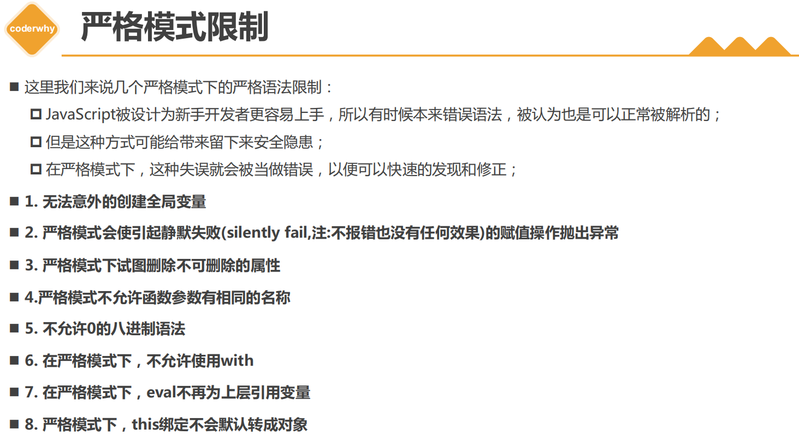
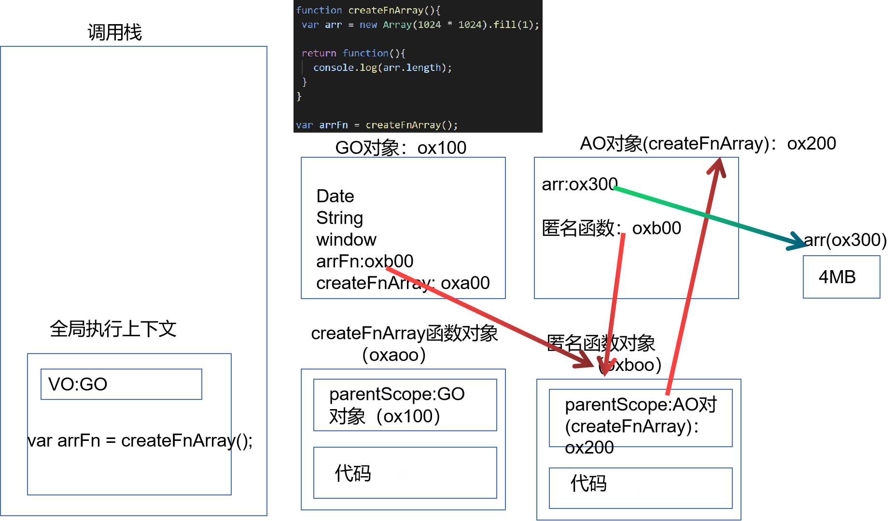

# **JS额外知识补充**

## 1.with语句

**with语句** 扩展一个语句的作用域链。

 不建议使用with语句，因为它可能是混淆错误和兼容性问题的根源。

严格模式下不能使用with语句

```js
var message = "Hello World"
var windowMessage = 'windowMessage'
// console.log(message)

// with语句: 可以形成自己的作用域
var obj = {name: "why", age: 18, message: "obj message"}

function foo() {
  function bar() {
    with(obj) {
      console.log(message) //"obj message"
      console.log("------")
      console.log(windowMessage);//windowMessage 
    }
  }//查找变量的时候，如果当前作用域没有，就往上一个作用域查找。其中with也是一个作用域
  bar()
}

foo()

var info = {name: "kobe"}
with(info) {
  console.log(name) //kobe
}
```

## 2.**eval函数**

eval是一个特殊的函数，它可以将传入的字符串当做JavaScript代码来运行。

```js
var jsString = 'var message = "Hello World"; console.log(message);'

var message = "Hello World"
console.log(message)

eval(jsString)
```


不建议在开发中使用eval： 

eval代码的可读性非常的差（代码的可读性是高质量代码的重要原则）；

eval是一个字符串，那么有可能在执行的过程中被刻意篡改，那么可能会造成被攻击的风险；

eval的执行必须经过JS解释器，不能被JS引擎优化；


## 3.**严格模式**

在ECMAScript5标准中，JavaScript提出了**严格模式的概念（Strict Mode）**： 

1. 严格模式很好理解，是一种具有限制性的JavaScript模式，从而使代码隐式的脱离了 ”懒散（sloppy）模式“； 

2. 支持严格模式的浏览器在检测到代码中有严格模式时，会以更加严格的方式对代码进行检测和执行； 

严格模式对正常的JavaScript语义进行了一些限制：

1. 严格模式通过 抛出错误 来消除一些原有的 静默（silent）错误；

2. 严格模式让JS引擎在执行代码时可以进行更多的优化（不需要对一些特殊的语法进行处理）；

3. 严格模式禁用了在ECMAScript未来版本中可能会定义的一些语法；





```js
// "use strict"

// 1. 禁止意外创建全局变量
// message = "Hello World"
// console.log(message)

// function foo() {
//   age = 20
// }

// foo()
// console.log(age)

// 2.不允许函数有相同的参数名称
// function foo(x, y, x) {
//   console.log(x, y, x)
// }

// foo(10, 20, 30)


// 3.静默错误
// true.name = "abc"
// NaN = 123
// var obj = {}
// Object.defineProperty(obj, "name", {
//   configurable: false,
//   writable: false,
//   value: "why"
// })
// console.log(obj.name)
// // obj.name = "kobe"

// delete obj.name

// 4.不允许使用原先的八进制格式 0123
// var num = 0o123 // 八进制
// var num2 = 0x123 // 十六进制
// var num3 = 0b100 // 二进制
// console.log(num, num2, num3)

// 5.with语句不允许使用

// 6.eval函数不会向上引用变量了
var jsString = '"use strict"; var message = "Hello World"; console.log(message);'
eval(jsString)

console.log(message)

```

严格模式下的this

```js
  "use strict"
// 在严格模式下, 自执行函数(默认绑定)会指向undefined
// 之前编写的代码中, 自执行函数我们是没有使用过this直接去引用window

function foo() {
  console.log(this)
}

var obj = {
  name: "why",
  foo: foo
}

foo()//undefined

obj.foo()//obj
var bar = obj.foo
bar()//undefined


// setTimeout的this
// fn.apply(this = window)
setTimeout(function() {
  console.log(this)
}, 1000);
//无论是不是严格模式，浏览器内部指向settimeout里面的fn的时候，都是默认绑定window的。

```

# 1. 基础总结深入
## 1.1 数据类型
### 1.1.1 基本（值）类型

* String : 任意字符串
* Number ：任意的数字
* boolean：true/false
* undefined:undefined
* null: null
### 1.1.2对象（引用）类型：
* Object: 任意对象
* Function： 一种特别的对象（可以执行，可调用）
* Array：一种特别的对象（数值下标， 内部数据是有序的）

### 1.1.3 判断方法

* typeof 返回数据类型的字符串表达， 可以判断undefined，数值， 字符串，布尔值， function
  不能判断 ： null 与object， object与array

* instanceof ：判断对象的具体类型，是函数还是数组

  ````js
      console.log(b1 instanceof Object, b1 instanceof Array); //true false
      console.log(b1.b2 instanceof Array, b1.b2 instanceof Object); // true true
      console.log(b1.b3 instanceof Function, b1.b3 instanceof Object); // true true
  ````

  

* 三个===号 ：可以判断undefined，null

  ````js
       a = null;
       console.log(typeof a); //object
       console.log(typeof a === 'null'); //false
       console.log(a === null); //true
       var fun1;
       console.log(fun1 === undefined);//true
  ````

  
### 1.1.4 问题

1. undefined 与null的区别？

​        undefined代表了定义了没有赋值（没定义的也是undefined）

​        null定义并赋值了，只是值为null

2. 什么时候给变量赋值null？

var b = null；//初始赋值为null， 代表我将要给这个值将要被赋予一个对象

b = [1 ,2];//确定对象就赋值

b = null; //最后，让b指向的对象称为垃圾对象（被垃圾回收器回收）

总结：

初始赋值，表明将要赋值为对象

结束前，让b指向的对象成为垃圾对象（被垃圾回收器回收）


3. 严格区别变量类型与数据类型？

   * 数据类型

     基本类型

     对象类型

   * 变量类型（变量内存值的类型）

   ​       基本类型：保存的是基本类型数据

   ​       引用类型：保存的是地址值，指向另外一个内存

## 1.2 数据_变量_内存

1. 什么是数据？

存储在内存中代表特定信息的东西，本质上是010101010
数据的特点：可传递， 可运算
一切皆数据
内存中所有操作的目标：数据
     算数运算
     逻辑运算
     赋值
     运行函数


2. 什么是内存？

* 内存条通电以后产生的可存储数据的空间（临时的）
* 内存产生和死亡。内存条（电路板）===》通电===》产生内存空间==》存储数据===》处理数据==》断电===》内存空间和数据都消失
* 一块小内存的两个数据：一个是内部存的数据  
 1 内部存储的数据
  2 地址值数据
* 内存的分类
  栈：全局变量/局部变量
  堆：对象


3. 什么是变量？

* 可变化的量，由变量名和变量值组成
* 每个变量都对应的一块小内存，变量名用来查找对应的内存，变量值就是内存中保存的数值，数据
* 


4. 内存，数据，变量三者之间的关系
* 内存用来存储数据的空间
* 变量是内存的标识

## 1.3 相关问题

1. var a = XXX , a 内存中到报错的是什么？
   答案：XXX是基本数据，保存的的就是这个数据
     XXX是对象，保存的就是对象的地址
     XXX是变量（b = a），保存的是XXX内存内容(可能是基本数据，也可能是地址数据)
2. 在js调用函数时传递变量参数时，是值传递还是引用传递
3. JS引擎如何管理内存？

   1. 生成周期

      分配小空间，得到它的使用权
      存储数据，可以反复进行操作
      释放小内存空间
      
   2. 释放内存
      局部变量 ： 函数执行完之后自动释放
      对象 ： 称为垃圾对象==》垃圾回收器回收
      
## 1.4 对象

1. 什么是对象？
 * 多个数据的封装体
 * 用来保存多个数据的容器
 * 一个对象代表现实生活中的一个事物

2. 为什么要用对象？
* 统一管理多个数据

3. 对象的组成
* 属性：由属性名（字符串）和属性值（任意类型）组成。属性名可以带双引号或者不带。
* 方法 ： 一种特别的属性（属性值是函数）


4. 如何访问对象的内部数据
* .属性名  p.setName("Bob")  编码简单， 有时候不能用
* ["属性名"] p.["setAge"](23)  编码复杂， 能通用
什么情况下必须使用['属性名']的方式？

## 1.5 函数

1.什么是函数？
实现特定功能的n条语句的封装体
还有函数是可以执行的，其他类型的数据不能执行

2.为什么要用函数？
* 提高代码复用
* 便于交流阅读

3.如何定义函数
* 函数声明
function fn1(){}
* 表达式
var fn2 = function(){}

4.如何调用（执行）函数？
* test()：直接调用
* obj.test():通过对象调用
*  new test() : new调用
*  test.call/apply(obj), 临时让test称为obj的方法进行调用

## 1.5 回调函数
1.什么函数才是回调函数？

1）你定义了
2）你没掉掉
3）最终它执行了（在某个时刻，或者某个条件下）
2.常见的回调函数?
1）dom事件的回调函数
2）定时器回调函数
3）ajax请求回调函数
4）生命周期回调函数


## 1.6 IIFE
1.理解
全称：Immediately-Involed Function Expression
立即执行函数表达式
2.作用
* 隐藏实现
* 不会污染外部命名空间（全局命名空间）

## 1.7 函数中的this
1.this是什么？

2.如何确定this的值？

# 2. 函数高级

代码分类：

全局代码

函数（局部）代码


有全局执行上下文和函数执行上下文

## 全局执行上下文

1. 在执行全局代码前，将window确定为全局执行上下文

2. 对全局数据进行预处理

  Var定义的变量：声明——》开辟内存地址，赋值为undefined，添加为winodw的属性

   function声明的的全局函数：声明——》开辟地址，赋值(fun)，添加为window的方法

​    this==》赋值（window）

2. 开始执行全局代码

无论查找变量还是函数，都要去window中去找，这个才是变量提升的执行规则，


## 函数执行上下文

1. 在调用函数之后，开辟出一个环境，也就是函数的范围 环境，也就是一块新的内存空间。里面存放下面函数定义的数据。这些变量的作用范围就是函数体内。

​    2. 对局部数据进行预处理

​      *形参变量==》开辟内存地址==》赋值（实参）==》添加为函数执行上下文的属性

​      *arguments==》赋值（实参列表），添加为执行上下文的属性

​      *var 定义的局部变量==》开辟内存地址==undefined，添加为执行上下文的属性

​      *function声明的函数==》开辟内存地址==赋值（fun），添加为执行上下文的方法

​      *this==》赋值（调用函数的对象）

    3. 开始执行函数体代码
       4. 函数执行完后，这个环境（内存空间）被清理掉，再次调用的时候，重新分配新的内存空间


## 执行上下文栈

1. 在全局代码执行前，JS引擎就会来创建一个栈来存储管理所有的执行上下文对象  后进先出

2. 在全局执行上下文（window）确定后，将其添加到栈中（压栈）

3. 在函数执行上下文创建后，将其添加到栈中（压栈）

4. 在当前函数执行完后，将栈顶的对象移除（出栈）

5. 但所有的函数代码执行完后，栈有只剩下window


# 3. 面向对象高级

# 4. 线程机制与事件机制


# 1.JavaScript的运行环境


## 1.1浏览器工作原理，核心


1、IE浏览器内核：Trident内核，也是俗称的IE内核；
 2、Chrome浏览器内核：统称为Chromium内核或Chrome内核，以前是Webkit内核，现在是Blink内核；
 3、Firefox浏览器内核：Gecko内核，俗称Firefox内核；
 4、Safari浏览器内核：Webkit内核；
 5、Opera浏览器内核：最初是自己的Presto内核，后来是Webkit，现在是Blink内核


## 1.2 浏览器渲染过程


js是高级语言，解析成机器语言，就需要js引擎


输入网址，DNS解析，返回ip

请求html页面

浏览器解析html页面，如果遇到css的话，会下载css；遇到script标签的话，会加载对应的js代码；

把这些东西都下载下来之后，接下来它会对css，js，html进行相关的操作；

html是第一个被下载下来的，下载下来之后，里面有很多的标签，开始对里面的标签进行解析，怎么解析的呢？就是由浏览器内核来帮助解析；浏览器内核里面有个HTML Parser；它通过Parser将html转换成dom树，

css也会被css Parser进行解析，解析成css规则；然后应用到dom树上面；就是css规则和dom树结合到一起变成attachment，然后就生成了render tree渲染树；接下来需要layout引擎对于这个渲染树做一些具体的操作，（不同宽度浏览器元素放的位置是不一样的，比如绝对定位；最终每个元素放到那个位置，展示什么样的效果，它还需要根据当前浏览器所处的状态，在进行一下对应的layout再做一下布局的，生产最终的渲染树）；有了渲染树之后，我们就可以进行绘制了，绘制出来之后浏览器进行展示


紫色三角形里面指的是js代码对dom进行操作，谁来帮我们执行这些js的指令？让他完成我们对应的操作？

答案是js引擎；


## 1.3JavaScript引擎


V8性能好，node也是使用的是v8


## 1.4 V8引擎的工作原理


parse 解析包括词法分析和语法分析；

词法分析给每个词解析，生成tokens，抽象语法树


## 1.5 **JavaScript的执行过程**


1.在代码第一步到第二步之间被解析的时候，v8引擎内部会帮我们创建一个对象GlobalObject，

2.并且解析js代码，将js里面的全局属性也放到globalObject对象里面；


```js
// js代码：
     var name = 'why';
    var num1 = 20;
    var num2 = 30;
    var result = num1 + num2;


1.在代码第一步到第二步之间被解析的时候，v8引擎内部会帮我们创建一个对象GlobalObject，
var globalObject = {
      String:'类',
      Date:'类',
      setTimeout:'函数',
      window:globalObject
    }
    console.log(window.window.window.window);
  //window就是指向当前的全局对象globalObject对象  

2.并且解析js代码，将js里面的全局属性也放到globalObject对象里面
    var globalObject = {
      String:'类',
      Date:'类',
      setTimeout:'函数',
      window:globalObject,
      name:undefined,
      num1:undefined,
      num2:undefined,
      result:undefined
    }

/*3.在变为字节码之后，进行执行js的时候，才会给属性赋值，就是途中的第四步（运行结果）
运行完之后
   var globalObject = {
      String:'类',
      Date:'类',
      setTimeout:'函数',
      window:globalObject,
      name:'why',
      num1:20,
      num2:30,
      result:50
    }*/
```


3.执行代码

 3.1 v8为了执行代码，v8引擎内部会有一个执行上下文栈**Execution Context Stack，简称ECS**（它是用于执行**代码的调用栈**。（内存的结构））js代码想运行，就必须把要运行的代码放到这个栈里面来；


比如说是，想要全局里面执行foo()这个函数，就需要把foo这个函数的代码放到栈里面，foo()里面还有调用另一个函数，再把另一个函数的代码放到栈里面；---》入栈


出栈：test函数执行完之后，代码就会被挪出栈，接下来foo函数执行完也会被挪出栈；一般栈里面是放函数的。var name = 'why';  var num1 = 20;之类的全局代码是不会放进栈里面的。

3.2 因为我们执行的是全局代码，为了全局代码能够正常运行，需要创建全局执行上下文**Global Execution Context（GEC）**（全局代码需要被执行时才会创建）

在执行全局代码的时候，会把GEC放入到栈里面，

GEC里面会创建VO对象，然后将VO（variable Object）指向GO（解析时候创建的全局对象）

放入栈后，就会开始真正执行代码


然后就是

var name = 'why';

  var num1 = 20;

  var num2 = 30;

  var result = num1 + num2;

这些代码从上往下依次执行；

第一行 var name = 'why';通过VO找到GO，将GO里面的变成 'why'

执行到第5行，就把50赋值给result；

作用域提升就是将全局的这些变量放到GO里面，以后要用的时候，就是去VO里面查找，只不过值时undefined


全局函数的执行

```js
 var name = 'why';

foo();
    function foo(){
      console.log('foo');
    }

    
```


编译阶段：

v8发现全局函数foo，会给foo开辟一个空间，创建一个函数对象，来存储foo函数；

这个函数对象包括两个部分，一个是父级作用域[parent scope]指的是函数的上一次作用域，也就是全局作用域vo

另一个是还会保存函数的执行体（函数的代码块 console.log('foo')）

以上，一旦开辟了一个内存空间，就会有内存地址，比如0xa00


// var GlobalObject = {

//  String: "类",

//  window: GlobalObject,

//  name: undefined,

//  foo: 0xa00

// }

编译完之后开始执行

执行第一行后

// var GlobalObject = {

//  String: "类",

//  window: GlobalObject,

//  name: 'why',

//  foo: 0xa00

// }

执行第三行foo()后

根据EGC里面的VO找到GO，然后找到foo的内存地址，

然后把这个函数对象放到ECStack里面，不是直接放进去，而是在ECS栈里面再自动创建一个函数执行上下文（Function execution context）FEC，然后，也不会马上执行，会先在函数执行上下文里面创建一个VO对象，对应的是AO对象，（Activation Object）活跃对象，将函数里面的变量提升到AO对象里面，如果foo是一下的函数，AO就是{

num:undefined,

m:undefined,

n:undefined

}

```js
foo(123)

function foo(num){
    
console.log(m)

var m = 0;

var n = 20l

console.log('foo')
}


```


接下来执行函数

先把123传给num，

接下来打印m，这时候m是undefined


接下来赋值m为10，

接下来赋值n为20

代码执行完之后，函数的执行上下文会弹出栈，这个函数执行上下文就会被销毁。然后VO对应的AO在没有东西执行它的时候， 它也会被销毁掉。如果接下来foo还会被调用的话，所有的以上过程也会重新再来一遍。


如果要打印name

```js
var name = 'why'
foo(123)

function foo(num){
    
console.log(m)

var m = 0;

var n = 20l

console.log(name)//'why'
}


```


为什么打印的上级作用域的name

它执行到console.log(name)，他就要去函数执行上下文的VO找，VO对应的AO，AO里面{num:123, m:10, n:20},里面没有name这个变量，没有的话应该怎么着呢？

其实当查找一个变量的时候，真是的查找路径是沿着作用域链去查找的， 在这里，除了有AO之外，还有个scope chain，是由VO和ParentScope组成的，函数的ParentScope是在函数编译的时候就已经被确认了。在这里，foo的ParentScope是全局变量，这里GO里面有name，就可以打印出来

在js里面，只有函数才会产生作用域


调用foo（123）的时候，创建AO对象之后，


图片里面的bar后面是0xb00

 

接下来执行foo里面的代码，执行到12行


执行到13行

一旦调用函数，就要在ECS里面创建函数的执行上下文,


创建bar的AO，然后执行代码体，console.log(name),

bar的AO里面是空的，就要去parent scope里面去找，bar是在foo函数内部定义的，它的上层作用域就是是foo这个函数，那就意味着他要去foo函数的AO，foo的AO也木有，就去foo的parent scope里面去找，foo的parent scope是GO，就找到了，打印的结果是'why'

然后bar的函数体代码执行完了，bar的函数执行上下文就会被弹出来来，销毁掉了，bar的AO也被销毁，然后foo也执行完了，foo的函数执行上下文也就完了，弹出来，被销毁，foo的AO也被销毁，oxboo储存的bar函数存储空间也被销毁


作用域链：沿着作用域的关系，一层一层开始去查找它的父级作用域，一直找到GO，GO也找不到，就会报错


举例

执行完第一行代码之后，


执行完foo（）之前


执行完console.log(message)代码之后


函数里面的变量和函数的调用位置没有关系，至于定义函数的位置有关系。虽然foo实在bar里面调用的，但是父级作用域还是全局的，使用GO里面的message。

 

## 1.6 环境变量和记录

GEC global execution context

FEC function execution context

* 其实我们上面的讲解都是基于早期ECMA的版本规范：

每一个执行上下文，不论是GEC还是FEC，都会被关联到一个环境变量（variable object, Vo）

在源代码中的变量和函数声明会被作为属性添加到VO中。

对于函数来说，参数也会被添加到VO中。


* 在最新的ECMA的版本规范中，对于一些词汇进行了修改：

每一个执行上下文会关联到一个变量环境(Variable Environment)中，在执行代码中变量和函数的声明会作为环境记录（Environment Record）添加到变量环境中。

对于函数来说，参数也会被作为环境记录添加到环境变量中，也就是name这个变量就是一条环境记录。


* 通过上面的变化我们可以知道，在最新的ECMA标准中，我们前面的变量对象VO已经有另外一个称呼了变量环境VE。


## 1.7 作用域提升面试题


1.

```js
     var n = 100;
     function foo(){
       n = 200;
     }
     foo()

     console.log(n);
```

2.

```js
     function foo(){
       console.log(n);
       var n = 200;
       console.log(n);
     }

     var n = 100;
     foo()
```


3.

```js
     var n = 100;
     function foo1(){
       console.log(n);
     }

     function foo2(){
       var n = 200;
       console.log(n);
       foo1();
     }

     foo2();
     console.log(n);
```


4.

```js
     var a = 100;
     function foo(){
       console.log(a);
       return
       var a = 100
     }

     foo()
```


5.

```js
     function foo(){
      var a = b = 100;
     }

     foo();
     console.log(a);
     console.log(b);
```


# **2. JS的内存管理和闭包**

## 2.1认识内存管理


## 2.2**JS的内存管理**


## **2.3 JS的垃圾回收**


### 1.常见的GC算法 – 引用计数（reference counting）


当前有一个引用指向我这个对象的时候，我就把我的计数器加1，这个数字存储在retain count里面。默认是0。

现在obj对象的引用是3，
如果写了个info.friend = null,引用就变成了2
当obj的引用变成0的时候，这个引用空间就会被GC回收。

但是引用计数存在一个很大的弊端，就是循环引用。
比如
var obj1 = {friend: obj2}
var obj2 = {firned: obj1}

除非 obj1.friend = null来解决。
### 2.常见的GC算法 – 标记清除


现在主要使用这种算法。


## 2.4 JS中函数是一等公民
在JavaScript中，函数是非常重要的，并且是一等公民： 那么就意味着函数的使用是非常灵活的；
函数可以作为另外一个函数的参数，也可以作为另外一个函数的返回值来使用；

高阶函数: 把一个函数如果接受另外一个函数作为参数,或者该函数会返回另外一个函数作为返回值的函数, 那么这个函数就称之为是一个高阶函数


## 2.5 函数和方法的区别


```js
// 函数function: 独立的function, 那么称之为是一个函数
function foo() {}
// 方法method: 当我们的一个函数属于某一个对象时, 我们成这个函数是这个对象的方法
var obj = {
  foo: function() {}
}
obj.foo()
```


##  2.6 数组中的高阶函数

### 1. filter()

```js
一：.filter方法 过滤
/* 

1.作用
filter用于对数组进行过滤。
它创建一个新数组，新数组中的元素是通过检查指定数组中符合条件的所有元素。
2.语法
Array.filter(function(currentValue, indedx, arr), thisValue)
其中，函数 function 为必须，数组中的每个元素都会执行这个函数。
这个函数也必须返回一个布尔值，且如果返回值为 true，则该元素被保留。
函数的第一个参数 currentValue 也为必须，代表当前元素的值

3.实例
返回数组nums中所有大于5的元素。

let nums = [1, 2, 3, 4, 5, 6, 7, 8, 9, 10];

let newNums = nums.filter(function(currentValue){
  return currentValue > 5
})

console.log(newNums);//[6, 7, 8, 9, 10]
     
4.实例

 [10, 5, 11, 100, 55]
 10 => false => 不会被放到newNums
 5 => false => 不会被放到newNums
 11 => false => 不会被放到newNums
 100 => false => 不会被放到newNums
 55 => false => 不会被放到newNums
 var newNums = nums.filter(function(item) {
   return item % 2 === 0 // 偶数
 })
 console.log(newNums)//[10, 100]


```

### 2. map()

```js

 二： map方法 映射


 1.作用
 map() 方法返回一个新数组，数组中的元素为原始数组元素调用函数处理后的值。
2.语法

array.map(function(currentValue,index,arr), thisValue)

在这里函数是必须的，数组中的每个元素都会执行这个函数

3.实例

var nums =  [10, 5, 11, 100, 55]
 var newNums2 = nums.map(function(item) {
   return item * 10
 })
 
 console.log(newNums2)//[100, 50, 110, 1000, 550]

```


### 3. forEach()

```js
三：forEach: 迭代(遍历)

 
 1.作用
forEach() 方法对数组的每个元素执行一次提供的函数。总是返回undefined；

2.语法

array.forEach(function(currentValue, index, arr), thisValue)

在这里函数是必须的，数组中每个元素需要调用的函数。

3.实例

// nums.forEach(function(item) {
//   console.log(item)
// })


```


### 4. find()/findIndex()

```js

四 find/findIndex
1.作用

   find()方法，用于找出第一个符合条件的数组成员。它的参数是一个回调函数，所有数组成员依次执行该回调函数，直到找出第一个返回值为true的成员，然后返回该成员。如果没有符合条件的成员，则返回undefined

   2. 语法

   array.find(function(currentValue, index, arr),thisValue)

   var students = [
  { id: 1, name: '张三', age: 18, sex: 0, like: '睡觉' },
  { id: 2, name: '李四', age: 35, sex: 0, like: '读书' },
  { id: 3, name: '王五', age: 60, sex: 0, like: '下棋' }
]

var stu = students.find(function(item){
  return item.id == 3
})
console.log(stu) 
// 打印结果为{ id: 3, name: '王五', age: 60, sex: 0, like: '下棋' }

var stu1 = students.findIndex(function(item){
 return item.id ==3
})
console.log(stu1);//2
```


### 5. reduce()

```js

五：reduce() 累加
 1.作用
reduce() 方法接收一个函数作为累加器，数组中的每个值（从左到右）开始缩减，最终计算为一个值。

2.语法

arr.reduce(function(prev,cur,index,arr){
...
}, init);
在这里用于执行每个数组元素的函数是必须的。

arr 表示原数组；
prev 表示上一次调用回调时的返回值，或者初始值 init;
cur 表示当前正在处理的数组元素；
index 表示当前正在处理的数组元素的索引，若提供 init 值，则索引为0，否则索引为1；
init 表示初始值

3.实例
求数组项之和

var arr = [3,9,4,3,6,0,9];
var sum = arr.reduce(function (prev, cur) {
    return prev + cur;
},0);

console.log(sum);//34


由于传入了初始值0，所以开始时prev的值为0，cur的值为数组第一项3，相加之后返回值为3作为下一轮回调的prev值，然后再继续与下一个数组项相加，以此类推，直至完成所有数组项的和并返回。

求数组项最大值

var max = arr.reduce(function (prev, cur) {
    return Math.max(prev,cur);
})

由于未传入初始值，所以开始时prev的值为数组第一项3，cur的值为数组第二项9，取两值最大值后继续进入下一轮回调。

数组去重
var newArr = arr.reduce(function (prev, cur) {
    prev.indexOf(cur) === -1 && prev.push(cur);
    return prev;
},[]);

① 初始化一个空数组
② 将需要去重处理的数组中的第1项在初始化数组中查找，如果找不到（空数组中肯定找不到），就将该项添加到初始化数组中
③ 将需要去重处理的数组中的第2项在初始化数组中查找，如果找不到，就将该项继续添加到初始化数组中
④ ……
⑤ 将需要去重处理的数组中的第n项在初始化数组中查找，如果找不到，就将该项继续添加到初始化数组中
⑥ 将这个初始化数组返回


```


## 2.7 JS中闭包的定义


从广义的角度来说：JavaScript中的函数都是闭包；

从狭义的角度来说：JavaScript中一个函数，如果访问了外层作用域的变量，那么它是一个闭包；


闭包由两部分组成：函数+可以访问的自由变量


按道理说，foo执行完之后，它的ao对象应该也就销毁了，但是因为闭包，它没有被销毁

### 1.普通函数执行

```js
var message = 'hello'；
function foo(){
  var name = 'foo';
  var age = 18;
}

function test(){
  console.log('test');
}

foo();
test();
```


1.在执行所有代码之前，引擎会在内存里创建GO对象（ox100），它里面有String对象啦，window对象这些对象。是被提前创建好的。然后现在去执行代码， GO对象是不会被销毁的

2.创建执行上下文栈

3.然后执行全局代码，创建全局执行上下文，然后创建全局执行上下文的VO，这个Vo指向GO。

4.然后，这个时候解析全局代码，往全局GO里面加东西了，原来的全局里面有Date,window,String等等，加入message（undefined）foo(oxa00)，test(oxboo)等变量。解析foo是函数，就创建一个函数对象foo（oxa00），里面有函数的父级作用域，也就是全局的GO对象（ox100）。,还有函数执行体（函数代码）。

解析test是函数，就创建一个函数对象test（oxb00），里面有函数的父级作用域，也就是全局的GO对象（ox100）。,还有函数执行体（函数代码）。


5 接下来执行执行代码，先给message赋值，变成了hello，然后执行函数foo。

6 创建foo函数的函数执行上下文。往里面创建VO对象，VO指向AO对象。创建一个foo函数的AO对象（ox200）。

默认里面没有对象，然后解析函数，里面放入name:undefined,age:undefined;


7.然后执行一行一行执行foo里面的代码，同时把AO里面的name赋值'foo'，age赋值18；


8.foo函数执行完之后，栈里面的foo函数执行上下文就会被销毁，一旦销毁，对foo的AO对象的引用将会没有，然后oxaoo就会被销毁。


一般情况下，在函数执行上下文被销毁的同时，函数的AO对象也会被销毁

9.test函数执行完之后也是一样，test的AO对象也会被销毁。代码执行完之后的内存结果就是上图。


### 2.闭包函数执行

```js


var message = 'hello'
function foo(){
  var name = 'foo';
  var age = 18;

  function bar(){
    console.log(name);
    console.log(age);
  }

  return bar
}


var fn = foo();
fn()
```


执行完var fn = foo();之后


然后foo的执行上下文被销毁，但是bar不会被销毁，因为fn指着它。
然后bar对象不会被销毁，它上面的foo的ao对象也不会被销毁的。因为bar里面有parentScope这个东西，它指向foo的AO对象。


接下来执行fn（）


然后销毁fn的执行上下文.


foo的AO对象是没有被销毁的，因为bar的父级作用域是指向foo的AO的。
内存泄漏：这里的bar函数对象一直不会被销毁，也就是foo的AO也一直不会被销毁。
如果执行完一次fn之后，就再也不会执行这个fn了，那么保存的bar和foo的AO也就没有意义了。
该销毁的东西没有被销毁，就是内存泄漏。
fn= null;就可以解决

虽然这时候bar和foo的AO循环引用，但是根据标记清除法，只要从根对象OG开始能找到的对象就不会被销毁。

但是bar和foo的AO从根对象指不向他们，他们就会被销毁。


如果也想销毁掉foo这个函数，也是一样，直接foo = null；就可以了；


## 2.8 内存泄漏




```HTML
<!DOCTYPE html>
<html lang="en">
<head>
  <meta charset="UTF-8">
  <meta http-equiv="X-UA-Compatible" content="IE=edge">
  <meta name="viewport" content="width=device-width, initial-scale=1.0">
  <title>Document</title>
</head>
<body>
  
</body>
<script>
  // var arr = new Array(1024 * 1024).fill(1)
  // console.log(arr);
   //整数占据四个字节 4Byte  1MB=1024KB
   //1024*1024*4 = 1024 * 1Kb * 4B = 4kB * 1024 = 4MB
   //现在这个数组占据的空间是4MB

   function createFnArray(){
    var arr = new Array(1024 * 1024).fill(1);

    return function(){
      console.log(arr.length);
    }
   }
   var arrayFns = [];

   for(var i = 0; i < 100; i++){
    
    //调用100次createFnArray(),就会有100个createFnArray对应的AO。
    //返回100个函数对象，每一个函数对象都会引用createFnArray对应的AO。
    arrayFns.push(createFnArray());
   }
</script>
</html>
```


### 1.闭包中没有被使用的属性

```js
   function foo(){
     var name = 'why';
     var age = 18;

    function bar(){
        debugger
      console.log(name);
    }
    return bar
   }

   var fn = foo();
   fn();
```


foo的AO对象不会被销毁，里面有name和age两个变量，name因为被bar引用，不会被销毁，但是从引擎优化的角度，发现这里age根本不会被用到，依然保留age的话，会占用内存空间，影响内存性能。一般情况下，js引擎会把多余的属性销毁掉。


# 3.**JS函数的this指向**

## 3.1 this的作用

从某些角度来说, 开发中如果没有this, 很多的问题我们也是有解决方案

但是没有this, 会让我们编写代码变得非常的不方便，就是改一个东西的话，就要很多东西该。


```js
var obj = {
  name: "why",
  eating: function() {
    console.log(this.name + "在吃东西")
  },
  running: function() {
    console.log(this.name + "在跑步")
  },
  studying: function() {
    console.log(this.name + "在学习")
  }
}

obj.eating();
obj.running();
obj.studying();

如果不使用this，可以使用
var obj = {
  name: "why",
  eating: function() {
    console.log(obj.name + "在吃东西")
  },
  running: function() {
    console.log(obj.name + "在跑步")
  },
  studying: function() {
    console.log(obj.name + "在学习")
  }
}
//如果哪一个obj的名字改了，就要改eating,running,studying里面的所有obj。比较麻烦。如果使用this的话，
//就只用该obj就好了
var obj100 = {
  name: "why",
  eating: function() {
    console.log(this.name + "在吃东西")
  },
  running: function() {
    console.log(this.name + "在跑步")
  },
  studying: function() {
    console.log(this.name + "在学习")
  }
}

obj100.eating();
obj100.running();
obj100.studying();
```


## 3.2 this在全局作用域下的指向


在全局作用域下

 浏览器下指向: window(globalObject)

 Node环境指向: {}  （一个空的对象）（node指向js代码的时候，会把js文件当作一个模块，

module-->加载--->编译--->放到一个函数里面--->执行这个函数.apply({})）

```js
console.log(this)
//Window {window: Window, self: Window, document: document, name: '', location: Location, …}
console.log(window)
//Window {window: Window, self: Window, document: document, name: '', location: Location, …}
```


但是，开发中很少直接在全局作用于下去使用this，通常都是在**函数中使用**。 

1. 所有的函数在被调用时，都会创建一个执行上下文：

2. 这个上下文中记录着函数的调用栈、AO对象等；

3. this也是其中的一条记录；


在执行代码的时候，比如console.log(this.name),就回去函数执行上下文栈中去看一下这个this到底是谁。那么this到底是谁呢？在这里，this是动态绑定的，就是指函数马上要被执行的时候，才会被绑定上去。不是在代码编译的时候确定的。是在函数马上执行的时候，才确定this是谁。所以有非常多的绑定规则。


 this指向什么, 跟函数所处的位置是没有关系的.跟函数的调用方式以及调用的位置有关系

## 3.3 **this绑定规则**

### 绑定一：默认绑定

函数没有被绑定到某个对象上进行调用（独立函数调用）

```js
// 默认绑定: 独立函数调用
// 1.案例一:
// function foo() {
//   console.log(this)
// }

// foo()

// 2.案例二:
// function foo1() {
//   console.log(this)
// }

// function foo2() {
//   console.log(this)
//   foo1()
// }

// function foo3() {
//   console.log(this)
//   foo2()
// }

// foo3()


// 3.案例三:
// var obj = {
//   name: "why",
//   foo: function() {
//     console.log(this)
//   }
// }

// var bar = obj.foo
// bar() // window


// 4.案例四:
// function foo() {
//   console.log(this)
// }
// var obj = {
//   name: "why",
//   foo: foo
// }

// var bar = obj.foo
// bar() // window

// 5.案例五:
function foo() {
  function bar() {
    console.log(this)
  }
  return bar
}

var fn = foo()
fn() // window

var obj = {
  name: "why",
  eating: fn
}

obj.eating() // 隐式绑定

```


###  绑定二：隐式绑定

是通过某个对象进行调用的

```js
// 隐式绑定: object.fn()
// object对象会被js引擎绑定到fn函数中的this里面

function foo() {
  console.log(this)
}

// 独立函数调用
// foo()

// 1.案例一:
// var obj = {
//   name: "why",
//   foo: foo
// }

// obj.foo() // obj对象

// 2.案例二:
// var obj = {
//   name: "why",
//   eating: function() {
//     console.log(this.name + "在吃东西")
//   },
//   running: function() {
//     console.log(obj.name + "在跑步")
//   }
// }

// // obj.eating()
// // obj.running()

// var fn = obj.eating
// fn()//取window里面的name


// 3.案例三:
var obj1 = {
  name: "obj1",
  foo: function() {
    console.log(this)
  }
}

var obj2 = {
  name: "obj2",
  bar: obj1.foo
}

obj2.bar()
```


### 绑定三：显示绑定

隐式绑定有一个前提条件：

1. 必须在调用的对象内部有一个对函数的引用（比如一个属性）；

2.  如果没有这样的引用，在进行调用时，会报找不到该函数的错误；

3. 正是通过这个引用，间接的将this绑定到了这个对象上；

   

 如果我们不希望在 **对象内部** 包含这个函数的引用，同时又希望在这个对象上进行强制调用，该怎么做呢？

1. JavaScript所有的函数都可以使用call和apply方法（这个和Prototype有关）。

​          它们两个的区别这里不再展开；

​           其实非常简单，第一个参数是相同的，后面的参数，apply为数组，call为参数列表；

2. 这两个函数的第一个参数都要求是一个对象，这个对象的作用是什么呢？就是给this准备的。

   3.在调用这个函数时，会将this绑定到这个传入的对象上。


因为上面的过程，我们明确的绑定了this指向的对象，所以称之为 **显示绑定**。


```js
// function foo() {
//   console.log("函数被调用了", this)
// }

// 1.foo直接调用和call/apply调用的不同在于this绑定的不同
// foo直接调用指向的是全局对象(window)
// foo()

// var obj = {
//   name: "obj"
// }

// call/apply是可以指定this的绑定对象
// foo.call(obj)
// foo.apply(obj)
// foo.apply("aaaa")


// 2.call和apply有什么区别?
function sum(num1, num2, num3) {
  console.log(num1 + num2 + num3, this)
}

sum.call("call", 20, 30, 40)
sum.apply("apply", [20, 30, 40])

// 3.call和apply在执行函数时,是可以明确的绑定this, 这个绑定规则称之为显示绑定

```


 **如果我们希望一个函数总是显示的绑定到一个对象上，可以怎么做呢？**

```js

function foo() {
  console.log(this)
}

// foo.call("aaa")
// foo.call("aaa")
// foo.call("aaa")
// foo.call("aaa")
//想foo的this一直绑定到aaa上面的话，每次都要用foo.call("aaa")
//很麻烦，想直接调用foo()就可以绑定aaa


var newFoo = foo.bind("aaa")

//bind会返回一个新的函数，这个函数里面的this就是aaa
// 默认绑定和显示绑定bind冲突: 优先级(显示绑定)

newFoo()
newFoo()
newFoo()
newFoo()
newFoo()
newFoo()

```


### 绑定四：new绑定

    1.创建一个全新的对象；
    2.这个新对象会被执行prototype连接；
    3.这个新对象会绑定到函数调用的this上（this的绑定在这个步骤完成）；
    4.如果函数没有返回其他对象，表达式会返回这个新对象；

```js
// 我们通过一个new关键字调用一个函数时(构造器), 这个时候this是在调用这个构造器时创建出来的对象
// this = 创建出来的对象
// 这个绑定过程就是new 绑定

function Person(name, age) {
  this.name = name
  this.age = age
}

var p1 = new Person("why", 18)
console.log(p1.name, p1.age)

var p2 = new Person("kobe", 30)
console.log(p2.name, p2.age)

```

## 3.4 一些函数里面this的分析


有些时候，我们会调用一些JavaScript的内置函数，或者一些第三方库中的内置函数。

这些内置函数会要求我们传入另外一个函数；

我们自己并不会显示的调用这些函数，而且JavaScript内部或者第三方库内部会帮助我们执行；

这些函数中的this又是如何绑定的呢？

```js
// 1.setTimeout


// setTimeout(function() {
//   console.log(this) // window
// }, 2000)
//将函数传递给setTimeOut函数，相当于下面的将fn传递给hySetTimeout函数
//setTimeOut里面是具体怎么调用这个fn函数的我们是不知道的
/* 可能是fn(),这个时候是this
可能是fn.call("abc")，这个时候this就是abc
所以用系统给我们的setTimeout的时候，是直接调用fn()
所以传入普通函数的时候，this指向的都是window */


// function hySetTimeout(fn, duration) {
//   fn.call("abc")
// }

// hySetTimeout(function() {
//   console.log(this) // window
// }, 3000)

// 2.监听点击
/* const boxDiv = document.querySelector('.box')
boxDiv.onclick = function() {
  console.log(this)
} */
/* 
把函数传递给了boxDiv的onclick这个属性，
函数在点击div的时候执行，执行的时候函数里面的this是什么呢？
其实内部是boxDiv.onclick()这个样子调用
就是隐士绑定，this就是boxDiv
*/

/* boxDiv.addEventListener('click', function() {
  console.log(this)
})
boxDiv.addEventListener('click', function() {
  console.log(this)
})
boxDiv.addEventListener('click', function() {
  console.log(this)
}) */

/* 
拿到所有的函数，然后
fn.call(boxDiv)进行调用

*/

// 3.数组.forEach/map/filter/find
/* 

高阶函数在用的时候，参数传入的函数是怎么被回调的？


*/
var names = ["abc", "cba", "nba"]
names.forEach(function(item) {
  console.log(item, this)
})

/* 

abc Window {window: Window, self: Window, document: document, name: '', location: Location, …}
test.html:112 cba Window {window: Window, self: Window, document: document, name: '', location: Location, …}
test.html:112 nba Window {window: Window, self: Window, document: document, name: '', location: Location, …}
*/

/* 
什么都不传的话，这里默认this是window
forEach中传入的第二个参数就是this的绑定

*/

var obj = {
  name:'why',
  age:18
}

names.forEach(function(item) {
  console.log(item, this)
}, obj)

/* 
abc {name: 'why', age: 18}
test.html:127 cba {name: 'why', age: 18}
test.html:127 nba {name: 'why', age: 18}
*/


names.map(function(item) {
  console.log(item, this)
})

/* 
abc Window {window: Window, self: Window, document: document, name: '', location: Location, …}
test.html:145 cba Window {window: Window, self: Window, document: document, name: '', location: Location, …}
test.html:145 nba Window {window: Window, self: Window, document: document, name: '', location: Location, …}
*/

names.map(function(item) {
  console.log(item, this)
}, obj)

/* 
abc {name: 'why', age: 18}
test.html:151 cba {name: 'why', age: 18}
test.html:151 nba {name: 'why', age: 18}
*/

function foo(){
  console.log(this );
}

var obj3 = { 
  name:'obj3'
}

foo.call()//window
foo.call(obj3)//obj3


```


## 3.5 **规则优先级**

**1.默认规则的优先级最低**

 毫无疑问，默认规则的优先级是最低的，因为存在其他规则时，就会通过其他规则的方式来绑定this

**2.显示绑定优先级高于隐式绑定**

```js
/ 1.call/apply的显示绑定高于隐式绑定
// obj.foo.apply('abc')
// obj.foo.call('abc')

// 2.bind的优先级高于隐式绑定
// var bar = obj.foo.bind("cba")
// bar()


// 3.更明显的比较
function foo() {
  console.log(this)
}

var obj = {
  name: "obj",
  foo: foo.bind("aaa")
}

obj.foo()//'aaa'

```

**3. new绑定优先级高于隐式绑定**

```js
var obj = {
  name: "obj",
  foo: function(a) {
    this.name = a;
    console.log(this)
  }
}

// new的优先级高于隐式绑定

/* 函数是可以通过new关键字来使用的 
如果里面的this指向obj，则隐式绑定优先级大，
如果this指向foo创建出来的函数对象，则new的绑定优先级大
*/

//obj.foo()//{name: 'obj', foo: ƒ}
 var f = new obj.foo('123');

```


**4.new绑定优先级高于bind**

 

new绑定和call、apply是不允许同时使用的，所以不存在谁的优先级更高

 new绑定可以和bind一起使用，new绑定优先级更高

```js
// 结论: new关键字不能和apply/call一起来使用

// new的优先级高于bind
function foo() {
  console.log(this)
}

// var bar = foo.bind("aaa")

// var obj = new bar()

// new绑定 > 显示绑定(apply/call/bind) > 隐式绑定(obj.foo()) > 默认绑定(独立函数调用)

```

## 3.6 **this规则之外 – 忽略显示绑定**

如果在显示绑定中，我们传入一个null或者undefined，那么这个显示绑定会被忽略，使用默认规则

```js
function foo() {
  console.log(this)
}

foo.apply("abc")//String {'abc'}
foo.apply({})//{}

// apply/call/bind: 当传入null/undefined时, 自动将this绑定成全局对象

foo.apply(null)//Window {window: Window, self: Window, document: document, name: '', location: Location, …}

foo.apply(undefined)//Window {window: Window, self: Window, document: document, name: '', location: Location, …}

var bar = foo.bind(null)
bar()//Window {window: Window, self: Window, document: document, name: '', location: Location, …}


```


## 3.7 **this规则之外 - 间接函数引用**

另外一种情况，创建一个函数的 间接引用，这种情况使用默认绑定规则。

赋值(obj2.foo = obj1.foo)的结果是foo函数；

foo函数被直接调用，那么是默认绑定；

```js
// 争论: 代码规范 ;

var obj1 = {
  name: "obj1",
  foo: function() {
    console.log(this)
  }
}

var obj2 = {
  name: "obj2"
};

 //obj2.bar = obj1.foo
 //obj2.bar()//{name: 'obj2', bar: ƒ}

(obj2.bar = obj1.foo)()//window  独立函数调用
/* 
会赋值表达式的结果做一个调用
赋值语句(表达式的值)的返回值为赋值结果。
就是foo这个函数
*/
```


```js
分号很关键
function foo(el){
  console.log(el, this.id);
}

var obj = {
  id:'awesome'
}

[1,2,3].forEach(foo, obj)
//test.html:58 Uncaught TypeError: Cannot read properties of undefined (reading 'forEach')

/* 

问题是obj后面没有加分号，就变成了这个
var obj = {
  id:'awesome'
}[1,2,3].forEach(foo,obj)

forEach前面就是{id:'awesome'}[1,2,3]
不是一个数组*/
```


## 3.8 **this规则之外 – ES6箭头函数**（arrow function）

在ES6中新增一个非常好用的函数类型：箭头函数，它比函数表达式要更加简洁

1.箭头函数不会绑定this，argument属性；

2.箭头函数不能作为构造函数来使用（不能和new一起使用，会抛出错误）

 3.箭头函数不使用this的四种标准规则（也就是不绑定this），而是根据外层作用域来决定this。 

```js
// 1.编写箭头函数
// 1> (): 参数
// 2> =>: 箭头
// 3> {}: 函数的执行体
var foo = (num1, num2, num3) => {
  console.log(num1, num2, num3)
  var result = num1 + num2 + num3
  console.log(result)
}

function bar(num1, num2, num3) {
}

// 高阶函数在使用时, 也可以传入箭头函数
var nums = [10, 20, 45, 78]
nums.forEach((item, index, arr) => {})

// 箭头函数有一些常见的简写:
// 简写一: 如果参数只有一个, ()可以省略
nums.forEach(item => {
  console.log(item)
})

// 简写二: 如果函数执行体只有一行代码, 那么{}也可以省略
// 强调: 并且它会默认将这行代码的执行结果作为返回值
nums.forEach(item => console.log(item))
//console.log(item)的返回值是undefined
var newNums = nums.filter(item => item % 2 === 0)
console.log(newNums)

// filter/map/reduce
var result = nums.filter(item => item % 2 === 0)
                 .map(item => item * 100)
                 .reduce((preValue, item) => preValue + item)
console.log(result)

// 简写三: 如果一个箭头函数, 只有一行代码, 并且返回一个对象, 这个时候如何编写简写
// var bar = () => {
//   return { name: "why", age: 18 }
// }

var bar = () => ({ name: "why", age: 18 })
//加个小括号，告诉箭头函数这个{ name: "why", age: 18 }是整体

```

测试箭头函数中this指向

```js
// 1.测试箭头函数中this指向
 var name = "why"

 var foo = () => {
   console.log(this)
 }

 foo()//window
 var obj = {foo: foo}
 obj.foo()//window
 foo.call("abc")//window 根据外层作用域来决定this。 
```


 我们来看一个模拟网络请求的案例：

这里我使用setTimeout来模拟网络请求，请求到数据后如何可以存放到data中呢？

我们需要拿到obj对象，设置data； 

 但是直接拿到的this是window，我们需要在外层定义：var _this = this

 在setTimeout的回调函数中使用_this就代表了obj对象

```js

// 2.应用场景
var obj = {
  data: [],
  getData: function() {
    // 发送网络请求, 将结果放到上面data属性中
    // 在箭头函数之前的解决方案
    // var _this = this
    // setTimeout(function() {
    //   var result = ["abc", "cba", "nba"]
    //   _this.data = result
    // }, 2000);
    // 箭头函数之后
    setTimeout(() => {
      var result = ["abc", "cba", "nba"]
      this.data = result
    }, 2000);

    //箭头函数不绑定this，意味着没有this，就要去上层作用域里面去找
    //上层作用域里面的this，也就是getData的this，
    //getData是通过obj来调用的，所以箭头函数里面的this指的就是obj对象
  }
}

obj.getData()
```

## 3.9 this面试题

**面试题一：**

```js
var name = "window";

var person = {
  name: "person",
  sayName: function () {
    console.log(this.name);
  }
};

function sayName() {
  var sss = person.sayName;
  sss(); // window: 独立函数调用
  person.sayName(); // person: 隐式调用
  (person.sayName)(); // person: 隐式调用
    //在这里，对JS引擎来说 加(person.sayName)这个括号和不加是一样的，直接取person里面sayName，对它进行调用
  (b = person.sayName)(); // window: 赋值表达式(独立函数调用)
}

sayName();
```

**面试题二：**

```js
var name = 'window'

var person1 = {
  name: 'person1',
  foo1: function () {
    console.log(this.name)
  },
  foo2: () => console.log(this.name),
  foo3: function () {
    return function () {
      console.log(this.name)
    }
  },
  foo4: function () {
    return () => {
      console.log(this.name)
    }
  }
}

var person2 = { name: 'person2' }

// person1.foo1(); // person1(隐式绑定)
// person1.foo1.call(person2); // person2(显示绑定优先级大于隐式绑定)

// person1.foo2(); // window(不绑定作用域,上层作用域是全局)
// person1.foo2.call(person2); // window

// person1.foo3()(); // window(独立函数调用)
// person1.foo3.call(person2)(); // window(独立函数调用)
// person1.foo3().call(person2); // person2(最终调用返回函数式, 使用的是显示绑定)

// person1.foo4()(); // person1(箭头函数不绑定this, 上层作用域this是person1)
// person1.foo4.call(person2)(); // person2(上层作用域被显示的绑定了一个person2)
// person1.foo4().call(person2); // person1(上层找到person1)
```

面试题3

```js
var name = 'window'

function Person (name) {
  this.name = name
  this.foo1 = function () {
    console.log(this.name)
  },
  this.foo2 = () => console.log(this.name),
  this.foo3 = function () {
    return function () {
      console.log(this.name)
    }
  },
  this.foo4 = function () {
    return () => {
      console.log(this.name)
    }
  }
}

var person1 = new Person('person1')
var person2 = new Person('person2')

person1.foo1() // person1
person1.foo1.call(person2) // person2(显示高于隐式绑定)

person1.foo2() // person1 (上层作用域中的this是person1)
person1.foo2.call(person2) // person1 (上层作用域中的this是person1)

person1.foo3()() // window(独立函数调用)
person1.foo3.call(person2)() // window
person1.foo3().call(person2) // person2

person1.foo4()() // person1
person1.foo4.call(person2)() // person2
person1.foo4().call(person2) // person1


var obj = {
  name: "obj",
  foo: function() {

  }
}


```

面试题4

```js
var name = 'window'

function Person (name) {
  this.name = name
  this.obj = {
    name: 'obj',
    foo1: function () {
      return function () {
        console.log(this.name)
      }
    },
    foo2: function () {
      return () => {
        console.log(this.name)
      }
    }
  }
}

var person1 = new Person('person1')
var person2 = new Person('person2')

person1.obj.foo1()() // window
person1.obj.foo1.call(person2)() // window
person1.obj.foo1().call(person2) // person2

person1.obj.foo2()() // obj
person1.obj.foo2.call(person2)() // person2
person1.obj.foo2().call(person2) // obj


// 

// 上层作用域的理解
// var obj = {
//   name: "obj",
//   foo: function() {
//     // 上层作用域是全局
//   }
// }

// function Student() {
//   this.foo = function() {

//   }
// }


```


##  3.10 实现call-apply-bind

### 3.10.1 基本（值）类型

* String : 任意字符串
* Number ：任意的数字
* boolean：true/false
* undefined:undefined
* null: null

### 3.10.2对象（引用）类型：

* Object: 任意对象
* Function： 一种特别的对象（可以执行，可调用）
* Array：一种特别的对象（数值下标， 内部数据是有序的）

### 3.10.3 基本包装类型

在JS中为我们提供了3个包装类，通过这三个包装类可以将基本数据类型转换成对象

1. String();

   可以将基本数据类型字符串转换为String对象

2. Number();

   可以将基本数据类型转换为Number对象

3. Boolean();

   可以将基本数据类型布尔值转换为Boolean对象

```js
    /* 方法和属性只能添加给对象，不能添加给基本数据类型 */
    /* 当我们对一些基本数据类型的值去调用属性和方法时，
    浏览器会临时使用包装类将其转换为对象，然后在调用对象的属性和方法 
    调用完之后，在将其转化为基本数据类型
    */
        var a = 123;
        console.log(typeof a); //number
        var num = new Number(3);
        console.log(num); //3
        console.log(typeof num); //object

        var b = 'hello'
        console.log(typeof b); //string
        var str = new String("hello");
        console.log(typeof str); //object

        var c = true;
        console.log(typeof c);
        var bool = new Boolean(true);//boolean
        console.log(typeof bool); //object
```

按道理基本数据类型是没有属性和方法的，而对象才有属性和方法，但上面代码却可以执行，这是因为 js 会把基本数据类型包装为复杂数据类型，其执行过程如下 ：

````js
//基本包装类型
var str = 'andy';
console.log(str.length);
//对象 才有属性和方法 复杂数据类型才有属性和方法
//简单数据类型为什么会有length属性呢？
//基本包装类型： 就是把简单数据类型 包装成了 复杂数据类型
//(1) 把简单数据类型包装为复杂数据类型
var temp = new String('andy');
//(2) 把临时变量的值给str
str = temp;
console.log(str.length);
//(3)销毁这个临时变量
temp = null;
//(4) 把基本包装类型再次转换成以前的普通字符串
str = "andy";

````


### 3.10.4 es6的剩余参数

```js
function func(a, ...rest) {
  console.log(a)
  console.log(rest)
}
func(1) //a: 1 rest:[]
func(1, 2, 3, 4)//a:1 rest[2, 3, 4]
```


- arguments是一个[伪数组](http://www.cnblogs.com/snandy/archive/2011/03/12/1981583.html)（Array-like）
- 剩余参数是一个真正数组（Array），具有Array.prototype上的所有方法
- arguments上有callee，callee上有[caller](http://www.cnblogs.com/snandy/archive/2011/03/22/1990938.html)

### 3.10.5 展开运算符

扩展运算符（ spread ）是三个点（...）。它好比 rest 参数的逆运算，将一个数组转为用逗号分隔的参数序列。

### 3.10.6 call实现

```js
//call函数的实现

function foo(){
  console.log(this);
}

var obj = {name: 'obj'};

//foo.call(obj)


Function.prototype.hycall = function(thisArg, ...args){
  //问题1：获取是哪一个函数执行了hycall
  //1.获取需要被执行的函数（通过隐式调用）
  var fn = this;
 
  
  //一般是将这个函数作为参数对象的一个属性，然后进行隐式调用
  //这样函数里面的this就是这个对象了。
  //但是
  //问题2：如果传入的是非对象类型
  //2.将非对象类型转换成对象类型, 比如123， 'why', 布尔类型
  //可以使用Object
  
  thisArg = (thisArg !== null && thisArg !== undefined) ? new Object(thisArg) : window
  //这个时候thisArg已经不是传入的对象了，地址不一样

  // 3.调用需要被执行的函数
  thisArg.fn = fn;
  //thisArg.fn()

  //4.接受传来的参数
  //使用展开运算符，该运算符将一个数组，变为参数序列。
  var result = thisArg.fn(...args);

  delete thisArg.fn

  //5. 将最终结果返回出去
 return result


}

function sum(a, b){
  console.log(a, b, this);
  return a + b
}


obj99 = {name: 'obj99'};

var testresult = sum.hyapply(obj99,[10,20]);


console.log(testresult);

function bar(){
  console.log('bar function')
}
bar.hyapply(obj99);

//foo.hycall()
/* 
不传值的话
  console.log(thisArg);//undefined
  console.log(thisArg == null);//true
  console.log(thisArg == undefined);//true
*/


foo.call(123)//Number {123}
foo.call(false)//Boolean {false}
foo.call('love')//String {'love'}
foo.call(null)//window
foo.call()//window
foo.call(undefined)//window


var a = 123;
var b = new Object(a)
console.log(a);//123
console.log(b);//Number {123}
var c = 'hello';
var d = new Object(c);
console.log(c);//hello
console.log(d);//String {'hello'}
var e = false;
var f = new Object(e);
console.log(e);//false
console.log(f);//Boolean {false}


function test(){
  console.log(arguments);
}

test(10,20,30,40)
//Arguments(4) [10, 20, 30, 40, callee: ƒ, Symbol(Symbol.iterator): ƒ]


function func(a, ...rest) {
  console.log(a)
  console.log(rest)
}
func(1) //a: 1 rest:[]
func(1, 2, 3, 4)//a:1 rest[2, 3, 4]

  console.log(...[1, 2, 3])  
  // 1 2 3  
  console.log(1, ...[2, 3, 4], 5)
  //1 2 3 4 5


  function foo1(a, b ){
  console.log(this);//{name: 'obj2'}
  return a + b
}

  var obj2 = {
    name : 'obj2',
  }
  var result = foo1.call(obj2, 10, 20)
  console.log(result);//30

  var result1 = foo1.hycall(obj2, 10, 20)
  console.log(result1);


  function mytest(arg){
    arg.a = 123;
    arg.b = 456;
  }
  obj4 = {name :'obj4'};
  mytest(obj4);
  console.log(obj4);//{name: 'obj4', a: 123, b: 456}

  function mytest1(arg){
    var newobj = arg;
    newobj.a = 123;
    newobj.b = 456;
  }
  obj5 = {name :'obj5'};
  mytest1(obj5);
  console.log(obj5);//{name: 'obj5', a: 123, b: 456}

  function mytest2(arg){
    arg = window;
    arg.a = 123;
    arg.b = 456;
  }
  obj6 = {name :'obj6'};
  mytest2(obj6);
  console.log(obj6);//{name: 'obj6'}
```


### 3.10.7 apply实现

```js

//apply函数的实现

Function.prototype.hyapply = function(thisArg, argArray){
// 1.获取到要执行的函数
  var fn = this;
  // 2.处理绑定的thisArg
  thisArg = (thisArg !== null && thisArg !== undefined) ? Object(thisArg): window
  // 3.执行函数
  thisArg.fn = fn;

  //var result = thisArg.fn(...argArray)
  //如果没有传参数，args就是undefined，...args会报错

  // argArray = argArray ? argArray: []
    argArray = argArray || []

  var result = thisArg.fn(...argArray)
  delete thisArg.fn;
 // 4.返回结果
  return result

}

```


### 3.10.8 bind实现

```js
Function.prototype.hybind = function(thisArg, ...argArray) {
  // 1.获取到真实需要调用的函数
  var fn = this

  // 2.绑定this
  thisArg = (thisArg !== null && thisArg !== undefined) ? Object(thisArg): window

  function proxyFn(...args) {
    // 3.将函数放到thisArg中进行调用
    thisArg.fn = fn
    // 特殊: 对两个传入的参数进行合并
    var finalArgs = [...argArray, ...args]
    var result = thisArg.fn(...finalArgs)
    delete thisArg.fn

    // 4.返回结果
    return result
  }

  return proxyFn
}

function foo() {
  console.log("foo被执行", this)
  return 20
}

function sum(num1, num2, num3, num4) {
  console.log(num1, num2, num3, num4)
}

// 系统的bind使用
var bar = foo.bind("abc")
bar()

// var newSum = sum.bind("aaa", 10, 20, 30, 40)
// newSum()

// var newSum = sum.bind("aaa")
// newSum(10, 20, 30, 40)

// var newSum = sum.bind("aaa", 10)
// newSum(20, 30, 40)


// 使用自己定义的bind
// var bar = foo.hybind("abc")
// var result = bar()
// console.log(result)

var newSum = sum.hybind("abc", 10, 20)
var result = newSum(30, 40)


```


### 3.10.9 对象中属性名加引号和不加引号的区别

#### 1.定义对象时

**一般情况下属性名加引号和不加引号是都可以的**，效果是一样的，比如下面age属性加不加引号都可以访问到的：


```js
var obj ={
  name: 'why',
  'age':18
}
console.log(obj.name);
console.log(obj.age);
```

但是，**不符合规范的属性名必须要加引号**

```js
var obj ={
  name: 'why',
  'age':18,
  18age:'myage'
}
```

18age会报错，写成下面的样子就不报错了

```js
var obj ={
  name: 'why',
  'age':18,
  '18age':'myage'
}
```

#### 2.访问对象属性时

```js
var obj ={
  name: 'why',
  'age':18,
  '18age':'myage'
}
console.log(obj.name);//'why'
console.log(obj[name]);//undefined
console.log(obj['name']);//'why'
console.log(obj['18age']);//'myage'
```

不符合规范的属性名**必须用obj[ ]方括号进行访问**

其他的可以通过obj.属性名或者obj[]来访问，其中[]里面必须加双引号，不然就会被认为是变量。

但是**纯数字的属性用[]进行访问的时候引号可以去掉的**

```js

var obj = {
    '0': 'a',
    '1': 'b'
}
 
obj[0] === obj['0']  // true
console.log(obj[1]);  // b

```

这也是js中数组是对象，但是数组能用array[index]访问的原理。

#### 3.通过变量来设置对象的Key值

```js


var name = 'realName';

var obj = {
  [name] : 'why',
  [name + 'I like js'] : 'test',
  age : 18
}

console.log(obj);
//{realName: 'why', realNameI like js: 'test', age: 18}

var addStr = 'addStrKey';
obj[addStr] = 'i am added';


console.log(obj);
//{realName: 'why', realNameI like js: 'test', age: 18, addStrKey: 'i am added'}


obj['addstr'] = 'i am added1';

console.log(obj);
//{realName: 'why', realNameI like js: 'test', age: 18, addStrKey: 'i am added', addstr: 'i am added1'}

```

### 3.10.10 arguments是什么

当我们不确定有多少个参数传递的时候，可以用 arguments 来获取。

**arguments** 是一个 对应于 **传递给函数的参数** 的 **类数组(array-like)对象**


array-like意味着它不是一个数组类型，而是一个对象类型：

但是它却拥有数组的一些特性，比如说length，比如可以通过index索引来访问；

但是它却没有数组的一些方法，比如forEach、map等

````
在调用函数的时候，浏览器每次都会传递两个隐形参数：
1.函数的上下文对象this
2.封装实参的对象arguments
		arguments是一个类数组对象,不是一个对象
        arguments instanceof Array //false
        Array.isArray(argumetns)//false
        它可以通过索引来操作数据，可以获取长度
        在调用函数时，我们所传递的实参都会封装到arguments中保存
        arguments.length可以获得实参长度
        即使不定义实参，也可以通过aguments来使用实参
        只不过比较麻烦，
        arguments[0]表示第一个实参
3.arguments实现里面有一个属性叫做callee
这个属性对应一个函数对象，就是当前正在指向的函数的对象
arguments.callee == fun // true
        
````


在 JavaScript 中，arguments 实际上它是当前函数的一个内置对象。所有函数都内置了一个 arguments 对象，arguments 对象中存储了传递的所有实参。

也只有函数才有arguments对象，而且是每个函数都内置好了这个arguments

arguments展示形式是一个伪数组，因此可以进行遍历。伪数组具有以下特点：

* 具有 length 属性
* 按索引方式储存数据
* 不具有数组的 push , pop 等方法


````
利用函数求任意个数的最大值 
function maxValue() {
      var max = arguments[0];
      for (var i = 0; i < arguments.length; i++) {
         if (max < arguments[i]) {
                    max = arguments[i];
         }
      }
      return max;
}
 console.log(maxValue(2, 4, 5, 9));
 console.log(maxValue(12, 4, 9));
````


### 3.10.11 arguments的基本使用

```js
function foo(num1, num2, num3){
  console.log(num1, num2, num3);
  console.log(arguments);
}

foo(10, 20, 30, 40, 50)
//10 20 30
//Arguments(5) [10, 20, 30, 40, 50, callee: ƒ, Symbol(Symbol.iterator): ƒ]
/*虽然看起来这个函数只有3个形参
但是函数内部会将所有调用函数时候传入的参数放到一个类数组对象里面
类数组对象中(长的像是一个数组, 本质上是一个对象): arguments

这些东西是放到ao里面的，未解析时ao是以下
var ao = {
  num1 : undefined,
  num2 : undefined,
  num3 : undefined,
  arguments : {},
}
解析完之后
var ao = {
  num1 : 10,
  num2 : 20,
  num3 : 30,
  arguments : {'0' : 10, '1': 20, '2': 30, '3' : 40, '4': 50}
}
*/
  
function foo1(num1, num2, num3){
   
  
  //常见的对argumetns的操作有三个
  //1.获取参数的长度
  console.log(arguments.length)//5

  // 2.根据索引值获取某一个参数
  console.log(arguments[2]) //30
  console.log(arguments[3]) //40
  console.log(arguments[4]) //50


  // 3.callee获取当前arguments所在的函数
  console.log(arguments.callee)
  // arguments.callee() //这样写会无限调用这个函数(递归)


}
foo1(10, 20, 30, 40, 50)
```


### 3.10.12 将arguments转成数组类型

```js

//1.自己遍历

function foo(num1, num2){
  var newArray = [];
  for(var i = 0; i < arguments.length; i++){
    newArray.push(arguments[i] * 10);
  }
  console.log(newArray); //(5) [100, 200, 300, 400, 500]


  //2.Array.prototype.slice将arguments转成arr
  var newArr2 = Array.prototype.slice.call(arguments)
  console.log(newArr2)

  var newArr3 = [].slice.call(arguments)
  console.log(newArr3)


  //es6语法
 //from() 方法从具有 length 属性或可迭代对象的任何对象返回 Array 对象。
 const myArr = Array.from("ABCDEFG");
 
 console.log(myArr);//(7) ['A', 'B', 'C', 'D', 'E', 'F', 'G']

var newArrays = [...arguments];
console.log(newArrays);//(5) [10, 20, 30, 40, 50]

}
 
 foo(10, 20, 30, 40, 50)
      //额外补充的知识点: Array中的slice实现
      //slice的本质就是迭代元素，伪数组也可以
      Array.prototype.hyslice = function(startIndex, endIndex){
        console.log(this);//这里的this就是调用这个函数的那个对象/数组
        var arr = this;
        var newArr = [];
        startIndex = startIndex || 0;
        endIndex = endIndex || arr.length;
         for(var i = startIndex; i < endIndex; i++){
           newArr.push(arr[i])
         }
         return newArr
      }

      var nums = [0, 1, 2, 3, 4];
      console.log(nums.hyslice());

      //拿到一个函数Function的对象foo去调aaa
      // Function.prototype.aaa = function(){...}
      // foo.aaa()
      //如果没有函数的对象，如何使用aaa这个方法？？
      //直接Function.prototype.aaa()这么去做

      //实际上下面两种方法是一样的
      var result = nums.hyslice(1,3);
      console.log(result);//(2) [1, 2]
      var result2 = Array.prototype.hyslice.call(nums, 1, 3)
      console.log(result2);//(2) [1, 2]

      
```


### 3.10.13 箭头函数中没有arguments

arguments是es5的老东西了，不推荐使用

```js
//1.案例一:
/* var foo = () => {
  console.log(artuments);
}

foo() */
//tUncaught ReferenceError: artuments is not defined
//全局里面没有arguments

//2.案例二:
//没有找到arguments怎么办，就去上层作用域中去寻找
//找到上层作用域的arguments

function foo(){
  var bar = () =>{
    console.log(arguments);
  }

  return bar
}

var fn = foo(123);
fn()

//Arguments [123, callee: ƒ, Symbol(Symbol.iterator): ƒ]

//3.案例三:
//如果没有arguments，但是我又想拿到参数
//答案是使用剩余参数
var foo1 = (num1, num2, ...args) => {
  console.log(args)  //(3) [30, 40, 50]
}

foo1(10, 20, 30, 40, 50)
```


# 4. **理解JavaScript纯函数**

函数式编程是一种编程范式，主要是利用函数把运算过程封装起来，通过组合各种函数来计算结果。函数式编程意味着你可以在更短的时间内编写具有更少错误的代码。

## 4.1 纯函数定义

 **函数式编程**中有一个非常重要的概念叫**纯函数**，JavaScript符合**函数式编程的范式**，所以也**有纯函数的概念**； 

1. 在**react开发中纯函数是被多次提及**的；

2.  比如**react中组件就被要求像是一个纯函数**（为什么是像，因为还有class组件），**redux中有一个reducer的概念**，也是要求必须是一个纯函数；

3. 所以**掌握纯函数对于理解很多框架的设计**是非常有帮助的；

   

**纯函数的定义:**

1.确定的输入，一定会产生确定的输出； 

2.函数在执行过程中，不能产生副作用；


**那么这里又有一个概念，叫做副作用**，什么又是**副作用**呢？

**副作用（side effect）:在计算机f科学中，也引用了副作用的概念，表示在执行一个函数时，除了返回函数值之外，还对调用函数产生了附加的影响，比如修改了全局变量，修改参数或者改变外部的存储；


## 4.2 **纯函数的案例**

```js
var names = ["abc", "cba", "nba", "dna"]

// slice只要给它传入一个start/end, 那么对于同一个数组来说, 它会给我们返回确定的值
// slice函数本身它是不会修改原来的数组
// slice -> this
// slice函数本身就是一个纯函数
// var newNames1 = names.slice(0, 3)
// console.log(newNames1)
// console.log(names)

// ["abc", "cba", "nba", "dna"]
// splice在执行时, 有修改掉调用的数组对象本身, 修改的这个操作就是产生的副作用
// splice不是一个纯函数
var newNames2 = names.splice(2)
console.log(newNames2)// ['nba', 'dna']
console.log(names)//(2) ['abc', 'cba']

var fruits = ["Banana", "Orange", "Apple", "Mango"];
var newFruits = fruits.splice(2, 1, "Lemon", "Kiwi");
console.log(newFruits);//['Apple']
console.log(fruits);//['Banana', 'Orange', 'Lemon', 'Kiwi', 'Mango']

//splice() 方法向/从数组添加/删除项目，并返回删除的项目。
```

## 4.3 **纯函数的优势**

**为什么纯函数在函数式编程中非常重要呢？**

1. 因为你可以安心的编写和安心的使用； 

2. 你在**写的时候**保证了函数的纯度，只是单纯实现自己的业务逻辑即可，不需要关心传入的内容是如何获得的或

者依赖其他的外部变量是否已经发生了修改；

3. 你在**用的时候**，你确定你的输入内容不会被任意篡改，并且自己确定的输入，一定会有确定的输出；


## 4.4 **JavaScript柯里化**

在计算机科学中，**柯里化**（英语：Currying），又译为**卡瑞化**或**加里化**；

**只传递给函数一部分参数来调用它，让它返回一个函数去处理剩余的参数；**

 这个过程就称之为柯里化；


## 4.5 **柯里化的结构**

```js

function add(x, y, z){
  return x + y + z
}

var result = add(10, 20, 30)
console.log(result);
//对上面的函数进行柯里化
function sum1(x){
  return function(y){
    return function(z){
      return x + y + z
    }
  }
}

var result1 = sum1(10)(20)(30)

console.log(result1);

/* var sum2 = (x) => {
  return (y) => {
    return (z) => {
      return x + y + z
    }
  }
}


var result2 = sum2(10)(20)(30);
console.log(result2); */

//简化箭头函数 如果参数只有一个, ()可以省略
//step1

/* var sum2 = x => {
  return y => {
    return z => {
      return x + y + z
    }
  }
} */

//如果函数执行体只有一行代码, 那么{}也可以省略
// 强调: 并且在{}省略的前提下它会默认将这行代码的执行结果作为返回值
//step2
var sum2 = x => y => z => x + y + z;
    
  
var result2 = sum2(10)(20)(30);
console.log(result2);
```

## 4.6 **为什么需要有柯里化**


### 1.让函数的职责单一

1. 在函数式编程中，我们其实往往希望一个函数处理的问题尽可能的单一，而不是将一大堆的处理过程交给一个

函数来处理； 

2. 那么我们是否就可以将每次传入的参数在单一的函数中进行处理，处理完后在下一个函数中再使用处理后的结 

果；

3. 比如上面的案例我们进行一个修改：**传入的函数需要分别被进行如下处理**

第一个参数 + 2 

第二个参数 * 2 

第三个参数 平方

```js
function foo(x){
  x = x + 2;
  return function(y){
    y = y * 2;
    return function(z){
      z = z*z
      return x + y + z
    }
  }
```


### 2.复用参数逻辑

对一些逻辑做一个复用

1. makeAdder函数要求我们传入一个count（并且如果我们需要的话，可以在这里对count进行一些修改）；

2. 在之后使用返回的函数时，我们不需要再继续传入count了；

```js
// function sum(m, n) {
//   return m + n
// }

// // 假如在程序中,我们经常需要把5和另外一个数字进行相加
// console.log(sum(5, 10))
// console.log(sum(5, 14))
// console.log(sum(5, 1100))
// console.log(sum(5, 555))

function makeAdder(count) {
  count = count * count

  return function(num) {
    return count + num
  }
}

// var result = makeAdder(5)(10)
// console.log(result)
var adder5 = makeAdder(5)
adder5(10)
adder5(14)
adder5(1100)
adder5(555)

```


逻辑的复用案例

```js
 function log(date, type, message){
  console.log(`[${date.getHours()}:${date.getMinutes()}][${type}]:[${message}]`);
} 

// log(new Date(), "DEBUG", "查找到轮播图的bug")
// log(new Date(), "DEBUG", "查询菜单的bug")
// log(new Date(), "DEBUG", "查询数据的bug")

//// 柯里化的优化

var log = date => type => message =>{
  console.log(`[${date.getHours()}:${date.getMinutes()}][${type}]:[${message}]`);
}
// 如果我现在打印的都是当前时间
var nowLog = log(new Date());
console.log(nowLog("Debug")("查找到轮播图的bug"));
console.log(nowLog("FEATURE")("查找到轮播图的bug"));

//如果都是"DEBUG"

var nowAndDebugLog = log(new Date())("DEBUG");
console.log(nowAndDebugLog("查询数据的bug"));
console.log(nowAndDebugLog("查询菜单的bug"));
```


## 4.7 js字符模板串

ES6中引入了模板字符串，让我们告别了使用大量'' 和 +来连接字符串了写法。

要创造一个模板字符串，只需要使用反引号``将字符串包起来，模板字符串中的变量用${变量名}替代即可

```js

var a = 'o,';var b = 'd!'
console.log (`Hell${a}worl${b}`);
// Hello,world!

1、多行字符串

在模板字符串内，换行和空格是会保存并展示出来的

var a = 'o,';var b = 'd!'
console.log(`Hell${a}
worl${b}`);
/*
Hello,
world!
*/

2、嵌入表达式

var a = 1; b = 2;
console.log (`${a} + ${b} = ${a + b} `)
//1 + 2 = 3
1
2
3
3、调用函数

function string(){
return "Hello！";
}
console.log(`${string()} world!`);
//Hello！ world!
```


## 4.8 柯里化函数的实现

```js

function add(x, y, z){

  return x + y + z
}


/* function hyCurring(fn){
  
  var myRet = function(...arg){
    if (fn.length > arg.length){
      return  function(...arg1){
        if(fn.length > (arg.length + arg1.length)){
          return function(...arg2){
            if(fn.length > (arg.length + arg1.length + arg2.length)){
              return 1111
            }else{
              return fn(...arg, ...arg1, ...arg2)
            }
          }
        }else{
          return fn(...arg,...arg1)
        }
      }
      
    }else{
      return fn(...arg)
    }
     

  }
  return myRet
} */


function hyCurring(fn){
//fn.length 得到函数fn有几个参数
  function curried(...arg){
    // 判断当前已经接收的参数的个数, 可以参数本身需要接受的参数是否已经一致了
    // 1.当已经传入的参数 大于等于 需要的参数时, 就执行函数
    if (arg.length >= fn.length){
      return fn.apply(this, arg)
    }else{
      // 没有达到个数时, 需要返回一个新的函数, 继续来接收的参数
      return function(...arg2){
        // 接收到参数后, 需要递归调用curried来检查函数的个数是否达到
        return curried.apply(this, arg.concat(arg2))
      }
    }
     

  }
  return curried
}

var curryAdd = hyCurring(add);
console.log(curryAdd(10)(20)(30));
console.log(curryAdd(10, 20)(30));
console.log(curryAdd(10, 20, 30));

```


## 4.9 理解组合函数

组合（Compose）函数是在JavaScript开发过程中一种对函数的使用技巧、模式：

1. 比如我们现在需要对某一个数据进行函数的调用，执行两个函数double和square，这两个函数是依次执行的；
2. 那么如果每次我们都需要进行两个函数的调用，操作上就会显得重复；
3. 那么是否可以将这两个函数组合起来，自动依次调用呢？
4. 这个过程就是对函数的组合，我们称之为组合函数（Compose Function）；

```js
function double(num) {
  return num * 2
}

function square(num) {
  return num ** 2
}

var count = 10
var result = square(double(count))
console.log(result)

// 实现最简单的组合函数
function composeFn(m, n) {
  return function(count) {
    return n(m(count))
  }
}

var newFn = composeFn(double, square)
console.log(newFn(10))

```

## 4.10 通用的组合函数的实现

```js

function double(m) {
  return m * 2
}

function square(n) {
  return n * n
}

function add(j){
  return j + 120
}

//var newFn = hyCompose(double, square, add)
var newFn = hyCompose()
console.log(newFn(10))//[10]


function hyCompose(...fns){
  var length = fns.length;
  for(var i = 0; i < length; i++){
    if(typeof fns[i] !== 'function'){
      throw new TypeError("Expected arguments are functions")
    }
  }
  function composed(...args){
    var result = length? fns[0].apply(this, args):args;
    for(var i = 1;  i < fns.length; i++){
      result = fns[i].call(this,result)
    }
    return result
  }
  return composed
}
```


# 5. **深入JS面向对象**

## 5.1 **JavaScript的面向对象**

 JavaScript其实支持多种编程范式的，包括**函数式编程和面向对象编程**： 

1. JavaScript中的对象被设计成一组属性的无序集合，像是一个哈希表，有key和value组成；
2. key是一个标识符名称，value可以是任意类型，也可以是其他对象或者函数类型； 
3. 如果值是一个函数，那么我们可以称之为是对象的方法； 

**如何创建一个对象呢？**

1. 早期使用创建对象的方式最多的是使用Object类，并且使用new关键字来创建一个对象：
2. 这是因为早期很多JavaScript开发者是从Java过来的，它们也更习惯于Java中通过new的方式创建一个对象；
3.  后来很多开发者为了方便起见，都是直接通过字面量的形式来创建对象： 这种形式看起来更加的简洁，并且对象和属性之间的内聚性也更强，所以这种方式后来就流行了起来；

## 5.2 创建对象的两种方式


## 5.3 对对象属性进行操作

```js
var obj = {
  name: "why",
  age: 18
}

// 获取属性
console.log(obj.name)

// 给属性赋值
obj.name = "kobe"
console.log(obj.name)

// 删除属性
// delete obj.name
// console.log(obj)

// 需求: 对属性进行操作时, 进行一些限制
// 限制: 不允许某一个属性被赋值/不允许某个属性被删除/不允许某些属性在遍历时被遍历出来

// 遍历属性
for (var key in obj) {
  console.log(key)
}

```


## 5.4 **对属性操作的控制**


## 5.5 Object.defineProperty


```js
var obj = {
  name: "why",
  age: 18
}

// 属性描述符是一个对象
Object.defineProperty(obj, "height", {
  // 很多的配置
  value: 1.88
})

console.log(obj)
console.log(obj.height)
```


### 1.属性描述符


n属性描述符的类型有两种：

1. 数据属性（Data Properties）描述符（Descriptor）；
2. 存取属性（Accessor访问器 Properties）描述符（Descriptor）；


### 2.**数据属性描述符**


1. configurable

```js
//数据属性描述符
Object.defineProperty(obj, "address", {
  value:"北京市",// 默认值undefined
  configuratble:false,// 默认值false
})
//设置了configuratble为false之后，就不能删除address和改变它
delete obj.address
console.log(obj);//{name: 'why', age: 18, address: '北京市'}
 Object.defineProperty(obj, "address", {
   value: "广州市",
   configurable: true
 })
console.log(obj);//报错 test.html:63 Uncaught TypeError: Cannot redefine property: address

//设置configuratble之后，就可以删除和修改这个属性
```

2. enumrable

```js
 var obj = {
  name: "why",
  age: 18
}

//数据属性描述符
Object.defineProperty(obj, "address", {
  value:"北京市",// 默认值undefined
  configuratble:false,// 默认值false
  //该特殊是配置对应的属性(address)是否是可以枚举
  enumerable:true,//默认值false
})
console.log(obj)
for (var key in obj) {
  console.log(key)
}
console.log(Object.keys(obj))
//设置enumerable为false的时候，是不可被枚举
//{name: 'why', age: 18, address: '北京市'}
//name age
//(2) ['name', 'age']

//设置为ture的话，是可以的
//{name: 'why', age: 18, address: '北京市'}
//name age address
//['name', 'age', 'address']
```

3.writable

```js
//数据属性描述符
Object.defineProperty(obj, "address", {
  value:"北京市",// 默认值undefined
  configuratble:false,// 默认值false
  //该特殊是配置对应的属性(address)是否是可以枚举
  enumerable:true,//默认值false
  //该特性是属性是否是可以赋值(写入值) 
  writable: true// 默认值false

})
//当设置为writable为false的时候
obj.address = "上海市"
console.log(obj.address)//"北京市"
//当设置为ture的时候
//上海市
```

 var obj = {
  name: "why",
  age: 18
}

// name和age虽然没有使用属性描述符来定义, 但是它们也是具备对应的特性的

// value: 赋值的value

// configurable: true

// enumerable: true

// writable: true

### 3.**存取属性描述符**


```js
var obj = {
  name: "why",
  age: 18,
  _address: "北京市"
}

// 存取属性描述符
// 1.隐藏某一个私有属性被希望直接被外界使用和赋值
// 2.如果我们希望截获某一个属性它访问和设置值的过程时, 也会使用存储属性描述符
Object.defineProperty(obj, "address", {
  enumerable: true,
  configurable: true,
  get: function() {
    foo()
    return this._address
  },
  set: function(value) {
    bar()
    this._address = value
  }
})

console.log(obj.address)

obj.address = "上海市"
console.log(obj.address)

function foo() {
  console.log("获取了一次address的值")
}

function bar() {
  console.log("设置了addres的值")
}


```

## 5.6 **同时定义多个属性**

```js
var obj = {
  // 私有属性(js里面是没有严格意义的私有属性)
  _age: 18,
  _eating: function() {},
  set age(value) {
    this._age = value
  },
  get age() {
    return this._age
  }
}

Object.defineProperties(obj, {
  name: {
    configurable: true,
    enumerable: true,
    writable: true,
    value: "why"
  },
/*   age: {
    configurable: true,
    enumerable: true,
    get: function() {
      return this._age
    },
    set: function(value) {
      this._age = value
    }
  } */
})

obj.age = 19
console.log(obj.age)

console.log(obj)

```

## 5.7 获取属性描述符

```js
var obj = {
  // 私有属性(js里面是没有严格意义的私有属性)
  _age: 18,
  _eating: function() {}
}

Object.defineProperties(obj, {
  name: {
    configurable: true,
    enumerable: true,
    writable: true,
    value: "why"
  },
  age: {
    configurable: true,
    enumerable: true,
    get: function() {
      return this._age
    },
    set: function(value) {
      this._age = value
    }
  }
})

// 获取某一个特性属性的属性描述符
console.log(Object.getOwnPropertyDescriptor(obj, "name"))
console.log(Object.getOwnPropertyDescriptor(obj, "age"))

// 获取对象的所有属性描述符
console.log(Object.getOwnPropertyDescriptors(obj))


```

## 5.8 Object的方法对对象限制

```js
var obj = {
  name: 'why',
  age: 18
}

// 1.禁止对象继续添加新的属性
Object.preventExtensions(obj)

obj.height = 1.88
obj.address = "广州市"

console.log(obj)

// 2.禁止对象配置/删除里面的属性
// for (var key in obj) {
//   Object.defineProperty(obj, key, {
//     configurable: false,
//     enumerable: true,
//     writable: true,
//     value: obj[key]
//   })
// }

Object.seal(obj)//让对象里面所有的属性不可配置

delete obj.name
console.log(obj.name)//why

// 3.让属性不可以修改(writable: false)
Object.freeze(obj)

obj.name = "kobe"
console.log(obj.name)//why

```

# 6.JS创建对象方案

## 6.1 创建对象方案-字面量

```js
var p1 = {
  name: "张三",
  age: 18,
  height: 1.88,
  address: "广州市",
  eating: function() {
    console.log(this.name + "在吃东西~")
  },
  running: function() {
    console.log(this.name + "在跑步~")
  }
}

var p2 = {
  name: "李四",
  age: 20,
  height: 1.98,
  address: "北京市",
  eating: function() {
    console.log(this.name + "在吃东西~")
  },
  running: function() {
    console.log(this.name + "在跑步~")
  }
}

var p3 = {
  name: "王五",
  age: 30,
  height: 1.78,
  address: "上海市",
  eating: function() {
    console.log(this.name + "在吃东西~")
  },
  running: function() {
    console.log(this.name + "在跑步~")
  }
}


```


## 6.2 创建对象方案-工厂模式

```js
  // 工厂模式: 工厂函数
function createPerson(name, age, height, address) {
  var p = {}
  p.name = name
  p.age = age
  p.height = height;
  p.address = address

  p.eating = function() {
    console.log(this.name + "在吃东西~")
  }

  p.running = function() {
    console.log(this.name + "在跑步~")
  }

  return p
}

var p1 = createPerson("张三", 18, 1.88, "广州市")
var p2 = createPerson("李四", 20, 1.98, "上海市")
var p3 = createPerson("王五", 30, 1.78, "北京市")

// 工厂模式的缺点(获取不到对象最真实的类型)
//只能看到是object类型，我们希望是createPerson类型
console.log(p1, p2, p3)

console.log(Object.getPrototypeOf(p1) === Object.prototype);//true
console.log(p1.constructor.name);//Object
```

工厂方法创建对象有一个比较大的问题：我们在打印对象时，对象的类型都是Object类型

但是从某些角度来说，这些对象应该有一个他们共同的类型；


## 6.3 认识构造函数

下面我们来看一下另外一种模式：构造函数的方式；

 我们先理解什么是构造函数？

1. 构造函数也称之为构造器（constructor），通常是我们在创建对象时会调用的函数；
2. 在其他面向的编程语言里面，构造函数是存在于类中的一个方法，称之为构造方法；
3. 但是JavaScript中的构造函数有点不太一样；

navaScript中的构造函数是怎么样的？

1. 构造函数也是一个普通的函数，从表现形式来说，和千千万万个普通的函数没有任何区别； 
2. 那么如果这么一个普通的函数被使用new操作符来调用了，那么这个函数就称之为是一个构造函数；

```js
function foo() {
  console.log("foo~, 函数体代码")
}

// foo就是一个普通的函数
// foo()

// 换一种方式来调用foo函数: 通过new关键字去调用一个函数, 那么这个函数就是一个构造函数了
var f1 = new foo
console.log(f1)


// 当我们通过new去调用一个函数时, 和通过的调用到底有什么区别?

```


### 1.**new操作符调用的作用**

如果一个函数被使用new操作符调用了，那么它会执行如下操作：

1. 在内存中创建一个新的对象（空对象）；

2. 这个对象内部的[[prototype]]属性会被赋值为该构造函数的prototype属性；（后面详细讲）；

3. 构造函数内部的this，会指向创建出来的新对象；

4. 执行函数的内部代码（函数体代码）；

5. 如果构造函数没有返回非空对象，则返回创建出来的新对象；

```js


 function foo(){
  // p1. 在内存中创建一个新的对象（空对象）；
  //var moni = {};
  //p3. 构造函数内部的this，会指向创建出来的新对象；
 // this = moni;
  //p4. 执行函数的内部代码（函数体代码）；
   console.log('foo函数被执行');
   //p5.如果构造函数没有返回非空对象，则返回创建出来的新对象；
  // return this
 }

 new foo //会打印foo函数被执行
 var f1 = new foo
 console.log(f1);//foo类型的对象

```

## 6.4 创建对象方案-构造函数

```js
// 规范: 构造函数的首字母一般是大写
function Person(name, age, height, address) {
  this.name = name;//这里的this就是刚刚创建出来的空对象
  this.age = age
  this.height = height
  this.address = address

  this.eating = function() {
    console.log(this.name + "在吃东西~")
  }

  this.running = function() {
    console.log(this.name + "在跑步")
  }
}


var p1 = new Person("张三", 18, 1.88, "广州市")
var p2 = new Person("李四", 20, 1.98, "北京市")

console.log(p1)//Person {name: '张三', age: 18, height: 1.88, address: '广州市', eating: ƒ, …}
console.log(p2)//Person {name: '李四', age: 20, height: 1.98, address: '北京市', eating: ƒ, …}
p1.eating()//张三在吃东西~
p2.eating()//李四在吃东西~
```


## 6.5 构造函数的缺点

```js
function foo() {
  function bar() {

  }
  return bar
}

var fn1 = foo()
var fn2 = foo()

console.log(fn1 === fn2)
```

## 6.6 对象的原型理解

```js
// 我们每个对象中都有一个 [[prototype]], 这个属性可以称之为对象的原型(隐式原型)

var obj = { name: "why" } // [[prototype]]
var info = {} // info里面有这个[[prototype]]对象

// 1.解释原型的概念和看一下原型
// 早期的ECMA是没有规范如何去查看 [[prototype]]

// 给对象中提供了一个属性, 可以让我们查看一下这个原型对象(浏览器提供)
// __proto__
// console.log(obj.__proto__) // {}
// console.log(info.__proto__) // {}

// 就像是var obj = {name: "why", __proto__: {} }

// // ES5之后提供的Object.getPrototypeOf
// console.log(Object.getPrototypeOf(obj))


// 2.原型有什么用呢?
// 当我们从一个对象中获取某一个属性时, 它会触发 [[get]] 操作
// 1. 在当前对象中去查找对应的属性, 如果找到就直接使用
// 2. 如果没有找到, 那么会沿着它的原型去查找 [[prototype]]
// obj.age = 18
obj.__proto__.age = 18

console.log(obj.age)

```

获取的方式有两种：

方式一：通过对象的 __proto__ 属性可以获取到（但是这个是早期浏览器自己添加的，存在一定的兼容性问

题）；

方式二：通过 Object.getPrototypeOf 方法可以获取到；

## 6.7 函数的原型理解

```js
function foo() {
}

// 1.函数也是一个对象
// console.log(foo.__proto__) // 函数作为对象来说, 它也是有[[prototype]] 隐式原型


// 2.函数它因为是一个函数, 所以它还会多出来一个显示原型属性: prototype，而且对象是没有这个属性的，只有函数有
console.log(foo.prototype)

var f1 = new foo()
var f2 = new foo()

console.log(f1.__proto__ === foo.prototype)
console.log(f2.__proto__ === foo.prototype)
```


我们前面讲过new关键字的步骤如下： 

1.在内存中创建一个新的对象（空对象）；

2.这个对象内部的[[prototype]]属性会被赋值为该构造函数的prototype属性；（后面详细讲）；

 那么也就意味着我们通过Person构造函数创建出来的所有对象的[[prototype]]属性都指向Person.prototype：


## 6.8 函数原型上的属性

```js
function foo() {

}

// 1.constructor属性
// foo.prototype这个对象中有一个constructor属性
// console.log(foo.prototype)
// console.log(Object.getOwnPropertyDescriptors(foo.prototype))//可枚举是false

// Object.defineProperty(foo.prototype, "constructor", {
//   enumerable: true,
//   configurable: true,
//   writable: true,
//   value: "哈哈哈哈"
// })

// console.log(foo.prototype)

// prototype.constructor = 构造函数本身
// console.log(foo.prototype.constructor) // [Function: foo]
// console.log(foo.prototype.constructor.name)

// console.log(foo.prototype.constructor.prototype.constructor.prototype.constructor)

// 2.我们也可以添加自己的属性
// foo.prototype.name = "why"
// foo.prototype.age = 18
// foo.prototype.height = 18
// foo.prototype.eating = function() {

// }

var f1 = new foo()
console.log(f1.name, f1.age)


// 3.直接修改整个prototype对象（适合于给原型添加东西很多的情况）
foo.prototype = {
  // constructor: foo,
  name: "why",
  age: 18,
  height: 1.88
}

var f1 = new foo()

console.log(f1.name, f1.age, f1.height)

// 真实开发中我们可以通过Object.defineProperty方式添加constructor
Object.defineProperty(foo.prototype, "constructor", {
  enumerable: false,
  configurable: true,
  writable: true,
  value: foo
})


```


## 6.9 创建对象方案-原型和构造函数

```js
function Person(name, age, height, address) {
  this.name = name
  this.age = age
  this.height = height
  this.address = address
}

Person.prototype.eating = function() {
  console.log(this.name + "在吃东西~")
}

Person.prototype.running = function() {
  console.log(this.name + "在跑步~")
}
//this是动态绑定的

var p1 = new Person("why", 18, 1.88, "北京市")
var p2 = new Person("kobe", 20, 1.98, "洛杉矶市")

p1.eating()
p2.eating()


```


## 6.10 原型链

原型对象也是对象，所以它也有原型
        当我们使用一个对象的属性或方法时，会先在自身中寻找，
        自身中如果有，则直接使用
         如果没有则去原型对象中寻找，如果原型对象中有，则使用
         如果没有，则去原型的原型中去寻找,直到找到Object对象的原型，再没有的话，就会返回undefined

## 6.11 总结

函数有一个prototype属性，它指向原型对象。原型对象里面有一个constructor属性，指向这个函数自己。

通过函数new出来的对象都有一个````__proto__````属性，这个属性指向函数的原型对象。

直接通过字面量{}或者new Object出来的对象也是有一个````__proto__````属性的，它指向Object函数的原型对象。

函数的原型对象也是一个对象，所以它是有一个````__proto__````属性的，指向Object的原型对象。

Object也是一个构造函数。但是它的原型对象是的````__proto__````属性是指向null的，这个比较特殊。


对象的原型最有钱。

普通函数的原型都是对象的原型的弟子，都可以访问对象的原型。

对象的原型的原型是null，它没有，其他的都没有。


# 7. **JavaScript中的类和对象**

当我们编写如下代码的时候，我们会如何来称呼这个Person呢？

1. 在JS中Person应该被称之为是一个构造函数；
2. 从很多面向对象语言过来的开发者，也习惯称之为类，因为类可以帮助我们创建出来对象p1、p2； 
3. 如果从面向对象的编程范式角度来看，Person确实是可以称之为类的；

## 7.1 **面向对象的特性 – 继承**


编写类的过程是一个封装的过程

继承：1重复利用一些代码（对代码的复用） 2.继承是多态的前提


## 7.2 Object的原型的原型是顶层原型

Object本质上是一个函数


## 7.3 **Object是所有类的父类**


Object的原型对象

特殊一：该对象有原型属性，但是它的原型属性已经指向的是null，也就是已经是顶层原型了；

特殊二：该对象上有很多默认的属性和方法；


## 7.4 为什么需要继承

```js
// Student
function Student(name, age, sno) {
  this.name = name
  this.age = age
  this.sno = sno
}

Student.prototype.running = function() {
  console.log(this.name + " running~")
}

Student.prototype.eating = function() {
  console.log(this.name + " eating~")
}

Student.prototype.studying = function() {
  console.log(this.name + " studying")
}

// Teacher
function Teacher(name, age, title) {
  this.name = name
  this.age = age
  this.title = title
}

Teacher.prototype.running = function() {
  console.log(this.name + " running~")
}

Teacher.prototype.eating = function() {
  console.log(this.name + " eating~")
}

Teacher.prototype.teaching = function() {
  console.log(this.name + " teaching")
}

```

这两个类的封装有很多重复的代码。属性name ,age

function running, function eating

我们想着是不是可以把这些公共的属性和代码都封装到一个父类里面，然后student和teacher（子类）再继承它，然后封装自己特有的属性和方法。


## 7.5 继承-使用原型链的继承方案****

```js
// 父类: 公共属性和方法
function Person() {
  this.name = "why"
  //this.friends = []
}

Person.prototype.eating = function() {
  console.log(this.name + " eating~")
}

// 子类: 特有属性和方法
function Student() {
  this.sno = 111
}

var p = new Person()
Student.prototype = p

Student.prototype.studying = function() {
  console.log(this.name + " studying~")
}


// name/sno
var stu = new Student()

// console.log(stu.name)
// stu.eating()

// stu.studying()

```


缺点：

```js

// 原型链实现继承的弊端:
// 1.第一个弊端: 打印stu对象, 继承的属性是看不到的
// console.log(stu.name) 可以打印出来，但是直接看不到，只能看到sno：11 和[[prototype]]这两个属性


// 2.第二个弊端: 创建出来两个stu的对象
var stu1 = new Student()
var stu2 = new Student()

如果给Person里面添加属性this.friends = []，
这样stu1有个frend，stu2有个friend
他们两个应该是相互独立的
如果给stu1.friend添加了一个‘kobe’
// 获取引用, 修改引用中的值, 会相互影响
stu1.friends.push("kobe")
再打印stu2.frined的话，结果是["kobe"],stu2.friend也被修改了

console.log(stu1.friends)
console.log(stu2.friends)


// 直接修改对象上的属性, 相当于是给本对象添加了一个新属性，不会互相影响
stu1.name = "kobe"
console.log(stu2.name)//"why"
再这里，stu1的name属性是被新地添加的，是属于自己的属性，但是stu2.name里面的name属性是使用的原型上面的name属性，也就是p对象上的name


// 3.第三个弊端: 在前面实现类的过程中都没有传递参数
var stu3 = new Student("lilei", 112)

“lilei”的处理应该是放到Person里面的，所以将参数传给student构造函数时不好处理的，所以要考虑怎么把"lilei"，也就是name这个参数传递给Perison构造函数
```


## 7.6 继承-借用构造函数（父构造函数）方案


```js
// 父类: 公共属性和方法
function Person(name, age, friends) {
  // this = stu
  this.name = name
  this.age = age
  this.friends = friends
}

Person.prototype.eating = function() {
  console.log(this.name + " eating~")
}

// 子类: 特有属性和方法
function Student(name, age, friends, sno) {
  Person.call(this, name, age, friends)//把Person当成一个普通的函数使用
  // this.name = name
  // this.age = age
  // this.friends = friends
  this.sno = 111
}

var p = new Person()
Student.prototype = p

Student.prototype.studying = function() {
  console.log(this.name + " studying~")
}


// name/sno
var stu = new Student("why", 18, ["kobe"], 111)

// console.log(stu.name)
// stu.eating()

// stu.studying()

```

弊端：

```js

// 原型链实现继承已经解决的弊端
// 1.第一个弊端: 打印stu对象, 继承的属性是看不到的===>解决，可以看到
console.log(stu)
//Student {name: 'why', age: 18, friends: Array(1), sno: 111}

// 2.第二个弊端: 创建出来两个stu的对象
var stu1 = new Student("why", 18, ["lilei"], 111)
var stu2 = new Student("kobe", 30, ["james"], 112)


// // 获取引用, 修改引用中的值, 会相互影响===>不会相互影响
stu1.friends.push("lucy")

console.log(stu1.friends)//(2) ['lilei', 'lucy']
console.log(stu2.friends)//['james']


// // 3.第三个弊端: 在前面实现类的过程中都没有传递参数===》解决：可以传递参数
// var stu3 = new Student("lilei", 112)


// 强调: 借用构造函数也是有弊端:
// 1.第一个弊端: Person函数至少被调用了两次
var p = new Person()的时候调用了一次，new Student的时候又调用了一次
// 2.第二个弊端: stu的原型对象（p对象）上会多出一些属性, 但是这些属性是没有存在的必要。==》name,friends,age都是undefined

```

## 7.7 继承-对象的原型式继承

实现的式一个对象继承另外一个对象

```js
var obj = {
  name:"why",
  age:18
}

//目的：创建一个对象，让这个对象的原型指向obj

//原型式继承函数实现1

function createObject1(o){
  var newObj = {}
  //Object.getPrototypeOf
  Object.setPrototypeOf(newObj, o)
  return newObj
}

var info = createObject1(obj);
console.log(info);
console.log(info.__proto__);


//原型式继承函数实现2
function createObject2(o){
  function Fn(){}
  Fn.prototype = o;
  var newObj = new Fn()
  return newObj
}
//为什么不这么写
/* 
var newObj = {};
newObj.__proto__ = o;
*/
//我们使用__proto__是为了打印，更好的看到原型对象
//真实开发里面是不会操作__proto__
var info2 = createObject2(obj);
console.log(info2);
console.log(info2.__proto__);

//原型式继承函数实现3
//直接使用Object.create方法

var info3 = Object.create(obj);
console.log(info3);
console.log(info3.__proto__);

```

实际上我们想实现的式一个构造函数继承另一个构造函数，比如new Student（）继承 new Person（），来实现代码的复用

## 7.8 继承-寄生式继承


```js
 
  var personObj = {
    running: function(){
      console.log("running");
    }
  }

function createStudent(name){
  var stu = Object.create(personObj);
  stu.name = name;
  stu.studying = function(){
    console.log("studying");
  }
  return stu
}

var stuObj = createStudent("why")
var stuObj1 = createStudent("kobe")
var stuObj2 = createStudent("james")


console.log(stuObj);

//工厂函数创建的，弊端很明确，不知道对象的类型
```

## 7.9 继承-寄生组合式继承

```js
  function Person(name, age, friends){
   this.name = name;
   this.age = age;
   this.friends = friends;
 }
Person.prototype.running = function(){
  console.log("running");
}
Person.prototype.eating = function(){
  console.log("eating");
}
function Student(name, age, friends, sno, score){
  Person.call(this, name, age, friends);
  this.sno = sno;
  this.score = score;
}
Student.prototype = Object.create(Person.prototype);
Student.prototype.studying = function(){
  console.log("studying");
}
var stu = new Student("why", 18, ["kobe"], 111, 100)
console.log(stu);//Student {name: 'why', age: 18, friends: Array(1), sno: 111, score: 100}
console.log(Object.getPrototypeOf(stu));//Person {studying: ƒ}
console.log(stu.constructor.name);//Person
 
```

node 打印结果

```js
Person {
  name: 'why',
  age: 18,
  friends: [ 'kobe' ],
  sno: 111,
  score: 100
}
Person { studying: [Function (anonymous)] }
Person
```

在这里，node和浏览器打印的stu的类型不一样，是因为浏览器做了特殊处理，让他显示成立Student，方便做调试，浏览器再调试工作中经常做类似的优化。

```js
Object.getPrototypeOf(obj) 
* 返回指定对象的原型（内部[[Prototype]]属性的值）。
* obj：要返回其原型的对象。
* 返回值：给定对象的原型。如果没有继承属性，则返回 null 。
```

node打印的类型就是stu.constructor.name。在这里，就是Person这个构造函数

在这里，stu的原型对象的值，就是stu.````__proto````是指向Person的原型的，

```js
console.log(stu.__proto__ === Object.getPrototypeOf(stu));//true
```


这样子做的话stu的类型还是Person，因为stu.constructor.name是Person

我们可以通过下面的方法解决，让Student的原型的constructor指向Student构造函数本身

```js
function Person(name, age, friends){
  this.name = name;
  this.age = age;
  this.friends = friends;
}
Person.prototype.running = function(){
 console.log("running");
}
Person.prototype.eating = function(){
 console.log("eating");
}
function Student(name, age, friends, sno, score){
 Person.call(this, name, age, friends);
 this.sno = sno;
 this.score = score;
}
Student.prototype = Object.create(Person.prototype);
 Object.defineProperty(Student.prototype, "constructor",{
 enumerable:false,
 configurable:true,
 writable:true,
 value:Student
})  

Student.prototype.studying = function(){
 console.log("studying");
}
var stu = new Student("why", 18, ["kobe"], 111, 100)
console.log(stu);
console.log(Object.getPrototypeOf(stu));
console.log(stu.constructor.name);
console.log(stu.__proto__ === Object.getPrototypeOf(stu));
console.log(stu.__proto__);
console.log(Student.prototype);
```

打印结果

```js
Student {
  name: 'why',
  age: 18,
  friends: [ 'kobe' ],
  sno: 111,
  score: 100
}
Person { studying: [Function (anonymous)] }
Student
true
Person { studying: [Function (anonymous)] }
```


现在student继承自person，以后想让teacher继承person就必须重新写，所以封装一下比较好。

```js
 /* 
  Object.create 是比较新的函数，
  大部分人会使用下面自己写的函数
  */
  function createObject(o){
    function Fn(){}
    Fn.prototype = o;
    return new Fn()
  }
  function inheritPrototype(SubType, SuperType) {
    SubType.prototype = Object.create(SubType.prototype);
    Object.defineProperty(SuperType.prototype, "constructor", {
      enumerable: false,
      configurable: true,
      writable: true,
      value: SubType
    })
  }
  function Person(name, age, friends) {
    this.name = name;
    this.age = age;
    this.friends = friends;
  }
  Person.prototype.running = function () {
    console.log("running");
  }
  Person.prototype.eating = function () {
    console.log("eating");
  }
  function Student(name, age, friends, sno, score) {
    Person.call(this, name, age, friends);
    this.sno = sno;
    this.score = score;
  }
/*   Student.prototype = Object.create(Person.prototype);
  Object.defineProperty(Student.prototype, "constructor", {
    enumerable: false,
    configurable: true,
    writable: true,
    value: Student
  })
 */
 inheritPrototype(Student, Person)
  Student.prototype.studying = function () {
    console.log("studying");
  }
  var stu = new Student("why", 18, ["kobe"], 111, 100)
  console.log(stu);
  console.log(Object.getPrototypeOf(stu));
  console.log(stu.constructor.name);
  console.log(stu.__proto__ === Object.getPrototypeOf(stu));
  console.log(stu.__proto__);
  console.log(Student.prototype);


```

打印结果

```js
Student {
  name: 'why',        
  age: 18,
  friends: [ 'kobe' ],
  sno: 111,
  score: 100
}
Person { studying: [Function (anonymous)] }
Student
true
Person { studying: [Function (anonymous)] }
Person { studying: [Function (anonymous)] }
```

## 7.10 **对象的方法补充**


### 1. Object.create()

```js
 var obj = {
  name: "why",
  age: 18
}

var info = Object.create(obj, {
  address: {
    value: "北京市",
    enumerable: true
  }
})

console.log(info);
console.log(info.__proto__);
//{address: '北京市'}
//test.html:65 {name: 'why', age: 18}
```

create后面可以选择两个参数，第一个是创建出来的新对象的原型，第二个是向往新对象里传入的属性。

### 2. Object.hasOwnProperty()

hasOwnProperty方法判断:

对象是否有某一个属于自己的属性（不是在原型上的属性）

```js

 var obj = {
  name: "why",
  age: 18
}

var info = Object.create(obj, {
  address: {
    value: "北京市",
    enumerable: true
  }
})

console.log(info);
console.log(info.__proto__);

//其中
console.log(info.address);
console.log(info.name);
console.log(info.age);
//都可以打印出来，但是address是info自己的属性，name和age是原型对象的属性
//怎么判断哪个是不是真的自己的呢

// hasOwnProperty方法判断(p 对象是否有某一个属于自己的属性（不是在原型上的属性）)
 console.log(info.hasOwnProperty("address"))//true
console.log(info.hasOwnProperty("age"))//false
console.log(info.hasOwnProperty("name"))//false

```

### 3. in操作符

in 操作符: 不管在当前对象还是原型中返回的都是true

```js
//in 操作符
console.log("address" in info)//true
console.log("name" in info)//true
console.log("age" in info)//true
```

### 3.for in 遍历

获取对象上面的所有属性

```js
 for (var key in info){
   console.log(key);
   console.log(info[key]);
 }
//address name age
```


### 4.**instanceof**

用于检测构造函数的pototype，是否出现在某个实例对象的原型链上

```js
function createObject(o) {
  function Fn() {}
  Fn.prototype = o
  return new Fn()
}

function inheritPrototype(SubType, SuperType) {
  SubType.prototype = createObject(SuperType.prototype)
  Object.defineProperty(SubType.prototype, "constructor", {
    enumerable: false,
    configurable: true,
    writable: true,
    value: SubType
  })
}


function Person() {

}

function Student() {

}

inheritPrototype(Student, Person)

console.log(Person.prototype.__proto__)

var stu = new Student()
console.log(stu instanceof Student) // true
console.log(stu instanceof Person) // true
console.log(stu instanceof Object) // true
```


### 5.isPrototypeOf

用于检测某个对象，是否出现在某个实例对象的原型链上

```js
function Person() {

}

var p = new Person()

console.log(p instanceof Person) //true
console.log(Person.prototype.isPrototypeOf(p))//true
//Person.prototype有没有出现在p的原型链上

var obj = {
  name: "why",
  age: 18
}

var info = Object.create(obj)

// console.log(info instanceof obj)//instanceof 后面只能是构造函数
console.log(obj.isPrototypeOf(info))//true
```

## 7.11 **原型继承关系**


```js
//Function 也是一个function，也有作为对象的属性，有__proto__属性
//任何一个函数的__proto__属性都是指向Function.prototype的
//Function 也是由 new Function()创建出来的
//就像是普通函数 Foo.__proto__ = Function.prototype

console.log(Function.prototype === Function.__proto__)//true
```


# 8. es6中类的使用

## 8.1 认识类


```js
// 类的声明
class Person {

}

// babel


// 类的表达式(用的比较少)
// var Animal = class {
// }


// 研究一下类的特性
console.log(Person.prototype)
console.log(Person.prototype.__proto__)
console.log(Person.prototype.constructor)
console.log(typeof Person) // function

var p = new Person()
console.log(p.__proto__ === Person.prototype) // true

//总结
/* 

class Person{

}
就是 function Person(){

}
构造函数的语法糖。
```


## 8.2 class的构造方法

```js
// 类的声明
class Person {
  // 类的构造方法
  // 注意: 一个类只能有一个构造函数
  // 1.在内存中创建一个对象 moni = {}
  // 2.将类的原型prototype赋值给创建出来的对象 moni.__proto__ = Person.prototype
  // 3.将对象赋值给函数的this: new绑定 this = moni
  // 4.执行函数体中的代码
  // 5.自动返回创建出来的对象
  constructor(name, age) {
    this.name = name
    this.age = age
  }
}


var p1 = new Person("why", 18)
var p2 = new Person("kobe", 30)
console.log(p1, p2)

```

## 8.3 JavaScript 对象访问器(补充)

ECMAScript 5 (2009) 引入了 Getter 和 Setter。

```js
JavaScript Getter（get 关键词）
//本例使用 lang 属性来获取 language 属性的值。
// 创建对象：
var person = {
  firstName: "Bill",
  lastName : "Gates",
  language : "en",
  get lang() {
    return this.language;
  },
  set lang(newLang) {
    console.log('setting lang');
    this.language = newLang;
  }
};

console.log(person.lang);//en
//意味着不对langeuage直接进行操作，而是通过lange这个方法进行对language的操作
person.lang = "CN";
console.log(person.lang);//CN
```

### 优点1：提供更简洁的语法

下面两个例子的区别在哪里？

例子 1

```
var person = {
  firstName: "Bill",
  lastName : "Gates",
  fullName : function() {
    return this.firstName + " " + this.lastName;
  }
};

// 使用方法来显示来自对象的数据：
document.getElementById("demo").innerHTML = person.fullName();
```

例子 2

```
var person = {
  firstName: "Bill",
  lastName : "Gates",
  get fullName() {
    return this.firstName + " " + this.lastName;
  }
};

// 使用 getter 来显示来自对象的数据：
document.getElementById("demo").innerHTML = person.fullName;
```


例子 1 以函数形式访问 fullName：person.fullName()。

例子 2 以属性形式访问 fullName：person.fullName。

第二个例子提供了更简洁的语法。


### 优点2： 提高数据质量

使用 getter 和 setter 时，JavaScript 可以确保更好的数据质量。

在本例中，使用 lang 属性以大写形式返回 language 属性的值：

实例

```
// Create an object:
var person = {
  firstName: "Bill",
  lastName : "Gates",
  language : "en",
  get lang() {
    return this.language.toUpperCase();
  }
};

// 使用 getter 来显示来自对象的数据：
document.getElementById("demo").innerHTML = person.lang;
```

## 8.4 class中的方法定义

Math

Math 不是构造函数。Math 的所有属性/方法都可以通过使用 Math 作为对象来调用，而无需创建它：

```js
//1.绝对值方法
Math.abs(1);//1
Math.abs(-1)//1
Math.abs('-1')//隐士转换 会把字符串-1转换为数字型
Math.abd('pink')//NaN
//2.三个取整方法
//(1) Math.floor() 往下取整，往最小了取值
Math.PI		 // 圆周率
Math.floor() 	 // 向下取整
Math.floor(1.6);//1
//(2)Math.ceil()    往上取整， 往最小了取值
Math.ceil()            // 向上取整
console.log(Math.ceil(7.004));//  8
//(3)Math.round()   四舍五入
Math.round()           // 四舍五入版 
四舍五入 其他数字都是四舍五入，但是.5特殊，它往大了取
Math.round(-1.5) //-1 
Math.round(1.5) //2
就近取整   注意 -3.5   结果是  -3 
```


```js
 var names = ["abc", "cba", "nba"];
class Person{
  constructor(name, age){
    this.name = name;
    this.age = age;
    this._address = "广州市";
  }

  //这里的eating和running本质上就是放在Person的prototype上的
//console.log(Object.getOwnPropertyDescriptors(Person.prototype))

  eating(){
    console.log(this.name + "eating");
  }

  runnning(){
    console.log(this.name + "running");
  }

  //类的访问器方法
  get address(){
    console.log("访问器拦截操作");
    return this._address
  }

  set address(newAddress){
    console.log("拦截设置操作");
    this._address = newAddress;
  } 

  //类的静态方法（类方法）
  //可以通过类名直接去访问
  // Person.createPerson()
  //静态方法通常用于定义直接使用类来执行的方法，不需要有类的实例，使用static关键字来定义：

  static randomPerson(){
    var nameIndex = Math.floor(Math.random()* names.length);
    var name = names[nameIndex];
    var age = Math.floor(Math.random()*100);
    return new Person(name, age)
  }
}

var p = new Person("why", 18);
p.eating();
p.runnning();

console.log(p.address)
p.address = "北京市"
console.log(p.address)//北京市

var p1 = Person.randomPerson();
console.log(p1);
for (var i = 0; i < 50; i++) {
  console.log(Person.randomPerson())
}
```


## 8.5 class中实现继承extends

### 1.父类属性的继承（super）

```js
class Person {
  constructor(name, age) {
    this.name = name
    this.age = age
  }
}

// Student称之为子类(派生类)
/* class Student extends Person {
  constructor(name, age, sno) {
    this.name = name;
    this.age = age;
    this.sno = sno
  }

} */

//会报错
//test.html:60 Uncaught ReferenceError: Must call super constructor in derived class before accessing 'this' or returning from derived constructor
//子类必须调用父类的构造方法
 // JS引擎在解析子类的时候就有要求, 如果我们有实现继承
//那么子类在子类的构造方法中, 在使用this之前，需要调用父类的构造方法
  //使用super关键字


  class Student extends Person {
  constructor(name, age, sno) {
    super(name, age)
    this.sno = sno
  }

}

var stu = new Student("why", 18, 111);
console.log(stu);
//Student {name: 'why', age: 18, sno: 111}
```


### 2. 父类原型方法的继承

```js
class Person {
  constructor(name, age) {
    this.name = name
    this.age = age
  }
  running() {
    console.log(this.name + " running~")
  }

  eating() {
    console.log(this.name + " eating~")
  }

}

  class Student extends Person {
  constructor(name, age, sno) {
    super(name, age)
    this.sno = sno
  }
  studying() {
    console.log(this.name + " studying~")
  }

}

var stu = new Student("why", 18, 111);
console.log(stu);
//Student {name: 'why', age: 18, sno: 111}
stu.studying();
stu.running();
stu.eating();

//在这里，studing是在Student的原型对象上的，running和eating是在Person的原型对象上的。
console.log(Object.getOwnPropertyDescriptors(stu.__proto__))//{constructor: {…}, studying: {…}}
console.log(Object.getOwnPropertyDescriptors(stu.__proto__.__proto__))//{constructor: {…}, running: {…}, eating: {…}}
//Student的原型对象的__proto—__指向Person的原型对象
console.log(Student.prototype.__proto__ === Person.prototype);//ture
console.log(stu.__proto__.__proto__ === Person.prototype);//ture
```

### 3. 子类对父类原型方法的重写

情况1：重写

```js
class Person {
  constructor(name, age) {
    this.name = name
    this.age = age
  }
  running() {
    console.log(this.name + " running~")
  }

  eating() {
    console.log(this.name + " eating~")
  }

}

  class Student extends Person {
  constructor(name, age, sno) {
    super(name, age)
    this.sno = sno
  }
  studying() {
    console.log(this.name + " studying~")
  }

   // 类对父类的方法的重写
   running() {
    console.log("student " + this.name + " running")
  }

}

var stu = new Student("why", 18, 111);
console.log(stu);
//如果子类不满意父类的running方法，可以在自己里面重新实现running方法
//到时候就会优先找自己的，而不是父类里面的

stu.running();//student why running
```

情况2：基于父类的逻辑重写

比如父类有下面一个方法

```js
  personMethod() {
    console.log("处理逻辑1")
    console.log("处理逻辑2")
    console.log("处理逻辑3")
  }
```

但是子类基于这个方法还有更多的逻辑

```js
  personMethod() {
    console.log("处理逻辑1")
    console.log("处理逻辑2")
    console.log("处理逻辑3")
    console.log("处理逻辑4")
    console.log("处理逻辑5")
    console.log("处理逻辑6")
  }
```

这时候完全像上面一样重写的话，就会出现重复代码，没有必要

这时候就需要使用super的第二个用法：

**在子类的实例方法里面调用父类的方法**

```js
  // 重写personMethod方法
  personMethod() {
    // 复用父类中的处理逻辑
    super.personMethod()

    console.log("处理逻辑4")
    console.log("处理逻辑5")
    console.log("处理逻辑6")
  }
```


整体代码：

```js
class Person {
  constructor(name, age) {
    this.name = name
    this.age = age
  }
  running() {
    console.log(this.name + " running~")
  }

  eating() {
    console.log(this.name + " eating~")
  }
  personMethod() {
    console.log("处理逻辑1")
    console.log("处理逻辑2")
    console.log("处理逻辑3")
  }

}

  class Student extends Person {
  constructor(name, age, sno) {
    super(name, age)
    this.sno = sno
  }
  studying() {
    console.log(this.name + " studying~")
  }

   // 重写personMethod方法
   personMethod() {
    // 复用父类中的处理逻辑
    super.personMethod()

    console.log("处理逻辑4")
    console.log("处理逻辑5")
    console.log("处理逻辑6")
  }

}

var stu = new Student("why", 18, 111);
console.log(stu);

stu.personMethod();
/* 
处理逻辑1
test.html:64 处理逻辑2
test.html:65 处理逻辑3
test.html:84 处理逻辑4
test.html:85 处理逻辑5
test.html:86 处理逻辑6
*/
```

### 4. 静态方法的继承

```js
class Person {
  constructor(name, age) {
    this.name = name
    this.age = age
  }
  running() {
    console.log(this.name + " running~")
  }

  eating() {
    console.log(this.name + " eating~")
  }

  static staticMethod() {
    console.log("PersonStaticMethod")
  }

}

  class Student extends Person {
  constructor(name, age, sno) {
    super(name, age)
    this.sno = sno
  }

 

}

var stu = new Student("why", 18, 111);

//调用Person的静态方法
Student.staticMethod();//PersonStaticMethod
```

### 5.  子类对父类静态方法的重写

情况1：完全重写

```js
class Person {
  constructor(name, age) {
    this.name = name
    this.age = age
  }
  running() {
    console.log(this.name + " running~")
  }

  eating() {
    console.log(this.name + " eating~")
  }

  static staticMethod() {
    console.log("PersonStaticMethod")
  }

}

  class Student extends Person {
  constructor(name, age, sno) {
    super(name, age)
    this.sno = sno
  }

    // 重写静态方法
    static staticMethod() {
    console.log("StudentStaticMethod")
  }

 

}

var stu = new Student("why", 18, 111);

//调用Person的静态方法
Student.staticMethod();//StudentStaticMethod
```

情况2：基于父类的重写

```js
class Person {
  constructor(name, age) {
    this.name = name
    this.age = age
  }
  running() {
    console.log(this.name + " running~")
  }

  eating() {
    console.log(this.name + " eating~")
  }

  static staticMethod() {
    
    console.log("PersonStaticMethod")
  }

}

  class Student extends Person {
  constructor(name, age, sno) {
    super(name, age)
    this.sno = sno
  }

    // 重写静态方法
    static staticMethod() {
    super.staticMethod()
    console.log("StudentStaticMethod")
  }

 

}

var stu = new Student("why", 18, 111);

//调用Person的静态方法
Student.staticMethod();
//PersonStaticMethod
//StudentStaticMethod
```

## 8.6 ES6转ES5的代码

[Babel · The compiler for next generation JavaScript (babeljs.io)](https://babeljs.io/)

IE：Edge 15可以支持 96% 的 ES6 新特性。Edge 14 可以支持 93% 的 ES6 新特性。（IE7~11 基本不支持 ES6）

es5

```js
class Person{}
```

es5

```js
function _classCallCheck(instance, Constructor) {
  if (!(instance instanceof Constructor)) {
    throw new TypeError("Cannot call a class as a function");
  }
}

var Person = function Person() {
  "use strict";
//检查this是不是Person创建出来的，
//是的话，那么就可以用instanceof来判断，instanceof就是判断某个对象是不是另一个对象的实例
  _classCallCheck(this, Person);
};

//_classCallCheck的作用就是不让你把Person当成一个普通的函数去调用它
//比如Person() 这种情况下this是window或者undifined
//而是希望new Person()

```


es6

```js
class Person{
  constructor(name, age){
    this.name = name;
    this.age = age;
  }
  eating(){
    console.log(this.name + "eating")
  }
}
```

es5

```js
function _classCallCheck(instance, Constructor) {
  if (!(instance instanceof Constructor)) {
    throw new TypeError("Cannot call a class as a function");
  }
}

function _defineProperties(target, props) {
  for (var i = 0; i < props.length; i++) {
    //获取当前对象
    var descriptor = props[i];
    //console.log(descriptor);//{key: 'eating', value: ƒ}
    //console.log(descriptor.enumerable);//undefined
    
    descriptor.enumerable = descriptor.enumerable || false;
    descriptor.configurable = true;
    if ("value" in descriptor) descriptor.writable = true;
    Object.defineProperty(target, descriptor.key, descriptor);
   //console.log(descriptor);
      /* configurable: true
      enumerable: false
      key: "eating"
      value: ƒ eating()
      writable: true */
  }
}

/*

  相当于给Person.prototype里面加入eating方法
*/

function _createClass(Constructor, protoProps, staticProps) {
     //如果是构造函数的话，直接给Person.prototype添加属性。
  if (protoProps) _defineProperties(Constructor.prototype, protoProps);
    //如果是构造函数的话，直接给Person添加方法。
  if (staticProps) _defineProperties(Constructor, staticProps);
  return Constructor;
}

//在这里，为什么要使用立即执行函数呢？两个原因
//1.它可以独立创建一个作用域，不会污染到全局，每个立即执行函数内的变量都是局部变量，不会有命名冲突的情况。
//2.方便进行进行tree-shaking处理
//标记这个函数为纯函数/*#__PURE__*/--》没有副作用
//纯函数被webpack做压缩的时候，是要做tree-shaking处理
//到时候对代码进行压缩的时候，发现这个函数没有被用过，在tree-shaking的时候，进行优化，直接删除掉这些代码，打包出来的包size小
var Person = /*#__PURE__*/ (function () {
  "use strict";

  function Person(name, age) {
    _classCallCheck(this, Person);

    this.name = name;
    this.age = age;
  }

  _createClass(Person, [
    {
      key: "eating",
      value: function eating() {
        console.log(this.name + "eating");
      }
    }
  ]);

  return Person;
})();

```


## 8.7 es6转es5的继承的代码

es6

```js
class Person{
  constructor(name, age){
    this.name = name;
    this.age = age;
  }

  running(){
    console.log(this.name + " runnning");
  }
}

class Student extends Person{
  constructor(name, age, sno){
    super(name, age);
    this.sno = sno;
  }
  studying(){
    console.log(this.name + " studying");
  }


}

```


es5

```js

function _typeof(obj) {
  "@babel/helpers - typeof";
  if (typeof Symbol === "function" && typeof Symbol.iterator === "symbol") {
    _typeof = function _typeof(obj) {
      return typeof obj;
    };
  } else {
    _typeof = function _typeof(obj) {
      return obj &&
        typeof Symbol === "function" &&
        obj.constructor === Symbol &&
        obj !== Symbol.prototype
        ? "symbol"
        : typeof obj;
    };
  }
  return _typeof(obj);
}

function _inherits(subClass, superClass) {
  if (typeof superClass !== "function" && superClass !== null) {
    throw new TypeError("Super expression must either be null or a function");
  }
  subClass.prototype = Object.create(superClass && superClass.prototype, {
    constructor: { value: subClass, writable: true, configurable: true }
  });

  /* 这里的目的是让Student.__proto__ = Person 
为了实现静态方法的继承
比如Student.staticMethod()
这里staticMathod没有在Student对象里面，
我们就要去Student.__proto__里面去找
Student.__proto__默认指的是Function.prototype,但是Function.prototype里面也没这个方法
我们就通过Student.__proto__ = Person ， 这里Person里面有这个方法
*/
  if (superClass) _setPrototypeOf(subClass, superClass);
}


function _setPrototypeOf(o, p) {
  _setPrototypeOf =
    Object.setPrototypeOf ||
    function _setPrototypeOf(o, p) {
      o.__proto__ = p;
      return o;
    };
  return _setPrototypeOf(o, p);
}

function _createSuper(Derived) {
  var hasNativeReflectConstruct = _isNativeReflectConstruct();
  return function _createSuperInternal() {
    var Super = _getPrototypeOf(Derived),
      result;
    if (hasNativeReflectConstruct) {
      var NewTarget = _getPrototypeOf(this).constructor;
      result = Reflect.construct(Super, arguments, NewTarget);
    } else {
      result = Super.apply(this, arguments);
    }
    return _possibleConstructorReturn(this, result);
  };
}

function _possibleConstructorReturn(self, call) {
  if (call && (_typeof(call) === "object" || typeof call === "function")) {
    return call;
  } else if (call !== void 0) {
    throw new TypeError(
      "Derived constructors may only return object or undefined"
    );
  }
  return _assertThisInitialized(self);
}

function _assertThisInitialized(self) {
  if (self === void 0) {
    throw new ReferenceError(
      "this hasn't been initialised - super() hasn't been called"
    );
  }
  return self;
}

function _isNativeReflectConstruct() {
  if (typeof Reflect === "undefined" || !Reflect.construct) return false;
  if (Reflect.construct.sham) return false;
  if (typeof Proxy === "function") return true;
  try {
    Boolean.prototype.valueOf.call(
      Reflect.construct(Boolean, [], function () {})
    );
    return true;
  } catch (e) {
    return false;
  }
}

function _getPrototypeOf(o) {
  _getPrototypeOf = Object.setPrototypeOf
    ? Object.getPrototypeOf
    : function _getPrototypeOf(o) {
        return o.__proto__ || Object.getPrototypeOf(o);
      };
  return _getPrototypeOf(o);
}

function _classCallCheck(instance, Constructor) {
  if (!(instance instanceof Constructor)) {
    throw new TypeError("Cannot call a class as a function");
  }
}

function _defineProperties(target, props) {
  for (var i = 0; i < props.length; i++) {
    var descriptor = props[i];
    descriptor.enumerable = descriptor.enumerable || false;
    descriptor.configurable = true;
    if ("value" in descriptor) descriptor.writable = true;
    Object.defineProperty(target, descriptor.key, descriptor);
  }
}

function _createClass(Constructor, protoProps, staticProps) {
  if (protoProps) _defineProperties(Constructor.prototype, protoProps);
  if (staticProps) _defineProperties(Constructor, staticProps);
  return Constructor;
}

var Person = /*#__PURE__*/ (function () {
  "use strict";

  function Person(name, age) {
    _classCallCheck(this, Person);

    this.name = name;
    this.age = age;
  }

  _createClass(Person, [
    {
      key: "running",
      value: function running() {
        console.log(this.name + " runnning");
      }
    }
  ]);

  return Person;
})();

var Student = /*#__PURE__*/ (function (_Person) {
  "use strict";

  _inherits(Student, _Person);
  /* 
  
  和以前寄生时候实现的方法是一样的，让Student继承Person

function inheritPrototype(SubType, SuperType) {
    SubType.prototype = Object.create(SubType.prototype);
    Object.defineProperty(SuperType.prototype, "constructor", {
      enumerable: false,
      configurable: true,
      writable: true,
      value: SubType
    })
  }

  */

  var _super = _createSuper(Student);

  function Student(name, age, sno) {
    var _this;

    //以前直接Person.call(this, name, age, friend)来实现的
    //但是Person不能直接调用Person()在es6里面
    _classCallCheck(this, Student);

    _this = _super.call(this, name, age);
    _this.sno = sno;
    return _this;
  }

  _createClass(Student, [
    {
      key: "studying",
      value: function studying() {
        console.log(this.name + " studying");
      }
    }
  ]);

  return Student;
})(Person);


// Super: Person
// arguments: ["why", 18]
// NewTarget: Student
// 会通过Super创建出来一个实例, 但是这个实例的原型constructor指向的是NewTarget
// 会通过Person创建出来一个实例, 但是这个实例的原型constructor指向的Person
//Reflect.construct(Super, arguments, NewTarget);

```

## 8.8 **继承内置类**

我们也可以让我们的类继承自内置类，比如Array

```js
// class Person {

// }

// class Student extends Person {

// }

class HYArray extends Array {
  firstItem() {
    return this[0]
  }

  lastItem() {
    return this[this.length-1]
  }
}

var arr = new HYArray(1, 2, 3)
console.log(arr.firstItem())//1
console.log(arr.lastItem())//3
```


## 8.9 **类的混入mixin**

 JavaScript的类只支持单继承：也就是只能有一个父类 

1. 那么在开发中我们我们需要在一个类中添加更多相似的功能时，应该如何来做呢？
2. 这个时候我们可以使用混入（mixin）；

```js
class Person {

}

/* class Runner{
running(){

}
}

*/
function mixinRunner(BaseClass) {
  class NewClass extends BaseClass {
    running() {
      console.log("running~")
    }
  }
  return NewClass
}


// 在JS中类只能有一个父类: 单继承
class Student extends Person {

}

var NewStudent = mixinRunner(Student)
var ns = new NewStudent()
ns.running()//running~
```


混入两个类

```js
class Person {

}

/* class Runner{
running(){

}
}

class Eater{
eatting(){

  }

} */
function mixinRunner(BaseClass) {
  class NewClass extends BaseClass {
    running() {
      console.log("running~")
    }
  }
  return NewClass
}

function mixinEater(BaseClass) {
  return class extends BaseClass {
    eating() {
      console.log("eating~")
    }
  }
}

// 在JS中类只能有一个父类: 单继承
class Student extends Person {

}

var NewStudent = mixinEater(mixinRunner(Student))
var ns = new NewStudent()
ns.running()
ns.eating()

```

弊端：以上方法没办法混入属性，或者在构造函数内传入一些参数

## 8.10 **JavaScript中的多态**


```js
// 传统的面向对象多态是有三个前提:
// 1> 必须有继承(是多态的前提)
// 2> 必须有重写(子类重写父类的方法),如果不重写，调用的都是父类的getArea（）（同一种行为），认为是没有多态的体现的。重写的话，传入r的情况，调入的是Rectangle类里面的getArea（）方法，
//传入c的情况下，调用的是Circle类里面的getArea（）方法，
//这样，就可以认为不同的数据类型执行同一个操作时, 如果表现出来的行为(形态)不一样,
// 3> 必须有父类引用指向子类对象

// Shape形状
class Shape {
  getArea() {}
}

class Rectangle extends Shape {
  getArea() {
    return 100
  }
}

class Circle extends Shape {
  getArea() {
    return 200
  }
}

var r = new Rectangle()
var c = new Circle()

// 多态: 当对不同的数据类型执行同一个操作时, 如果表现出来的行为(形态)不一样, 那么就是多态的体现.
function calcArea(shape: Shape) {
  console.log(shape.getArea())
}

calcArea(r)
calcArea(c)

export {}
```

